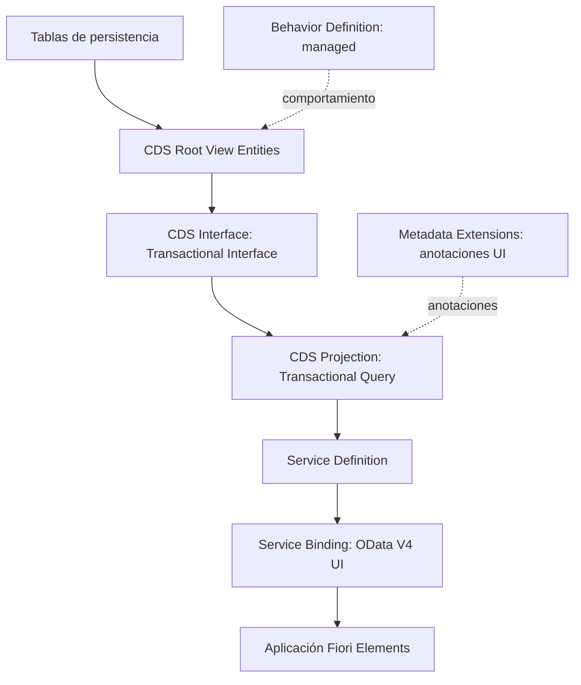

El canal de YouTube de Logali Tech publica **«SAP ABAP Cloud RAP de cero a experto»**, una serie gratuita sobre el ABAP RESTful Application Programming Model. La serie construye, vídeo a vídeo y sobre un sistema real de SAP BTP, una aplicación transaccional de gestión de viajes. Los 40 vídeos publicados recorren desde la creación de la cuenta hasta la Behavior Definition, pasando por el modelo de datos en CDS, los servicios OData y la interfaz con Fiori Elements.

Este artículo resume qué cubre la serie, cómo está organizada y cómo aprovecharla.

## Datos clave de la serie

| Concepto | Detalle |
|---|---|
| Formato | Lista de reproducción en YouTube, en español |
| Coste | Gratuita y sin registro |
| Vídeos publicados | 40, con 6 h 6 min de contenido (octubre de 2026) |
| Vídeos previstos | 66 en total |
| Entorno | SAP BTP ABAP Environment (cuenta trial) y Eclipse con ABAP Development Tools |
| Caso práctico | Aplicación de gestión de viajes con la jerarquía Travel, Booking y Booking Supplement |
| Tipo de servicio | OData V4 para interfaz de usuario, consumido por Fiori Elements |
| Nivel | Desde cero hasta conceptos avanzados de RAP |

## Por qué SAP RAP es relevante

RAP es el modelo de programación de ABAP Cloud para construir aplicaciones transaccionales SAP Fiori y APIs web basadas en OData. Para nuevos desarrollos sustituye a enfoques anteriores, como los servicios OData creados con la transacción SEGW o el modelo de programación basado en BOPF.

Tres motivos explican su peso actual en los proyectos SAP:

1. **Clean core.** RAP trabaja con APIs liberadas y objetos de desarrollo con contrato estable. Las extensiones construidas así no modifican el estándar y resisten las actualizaciones del sistema. El enfoque se desarrolla en [Clean Core para developers](/blog/clean-core-para-developers/).
2. **Un único modelo para varios entornos.** Los mismos conceptos (CDS, Behavior Definition, Service Definition y Service Binding) se aplican en SAP BTP ABAP Environment y en SAP S/4HANA.
3. **Menos código de infraestructura.** En el escenario managed, el framework se ocupa de la persistencia, los bloqueos y el control de concurrencia. El desarrollador se centra en la lógica de negocio.

## Arquitectura que se construye en la serie

La aplicación se desarrolla por capas. El diagrama muestra el recorrido desde la base de datos hasta la aplicación Fiori Elements, en el mismo orden en que lo presenta la serie.

Las tablas de persistencia corresponden a las tres entidades del caso práctico: Travel, Booking y Booking Supplement. La capa raíz define la composición y las asociaciones entre ellas.

## Temario completo

La serie está organizada en cinco bloques. Cada título enlaza con el vídeo correspondiente dentro de la lista de reproducción.

### Bloque 1. Entorno de desarrollo (6 vídeos, 58 min)

Preparación del entorno: cuenta de SAP BTP, instancia de ABAP Cloud, conexión desde Eclipse y respaldo del código en GitHub.

| N.º | Vídeo | Contenido | Duración |
|---:|---|---|---:|
| 1 | [Cuenta de SAP BTP](https://www.youtube.com/watch?v=j5gh1X7w6Jc&list=PLa8oVCEIJRoM&index=1) | Registro de la cuenta trial gratuita, periodo de 90 días y primer recorrido por el cockpit | 10:57 |
| 2 | [Instancia de ABAP Cloud](https://www.youtube.com/watch?v=rEKvvDtEPh4&list=PLa8oVCEIJRoM&index=2) | Suscripción al servicio ABAP Environment desde el Service Marketplace o con Boosters, y obtención del Service Key | 6:28 |
| 3 | [Proyecto ABAP Cloud](https://www.youtube.com/watch?v=nxBiV43S2Vc&list=PLa8oVCEIJRoM&index=3) | Creación del ABAP Cloud Project en Eclipse y conexión con la instancia mediante login por navegador | 5:18 |
| 4 | [Cuenta empresarial](https://www.youtube.com/watch?v=25TcMiWwUwM&list=PLa8oVCEIJRoM&index=4) | Diferencias entre cuenta trial y empresarial, y configuración en un entorno productivo | 9:03 |
| 5 | [abapGit](https://www.youtube.com/watch?v=vUCnTyppVsU&list=PLa8oVCEIJRoM&index=5) | Instalación del plugin abapGit en Eclipse | 5:09 |
| 6 | [Respaldo del código](https://www.youtube.com/watch?v=juz-_d3QhPI&list=PLa8oVCEIJRoM&index=6) | Conexión de abapGit con GitHub para versionar, subir y recuperar el código | 20:41 |

### Bloque 2. Modelo de datos con CDS (11 vídeos, 1 h 52 min)

Construcción del modelo de datos: tablas, datos de prueba y las tres capas CDS del Business Object, con sus relaciones.

| N.º | Vídeo | Contenido | Duración |
|---:|---|---|---:|
| 7 | [Creación de tablas](https://www.youtube.com/watch?v=lWB_TiFYWlg&list=PLa8oVCEIJRoM&index=7) | Arquitectura de capas de RAP y tablas de persistencia con claves UUID, importes con moneda y campos de auditoría | 15:32 |
| 8 | [Inserción de datos](https://www.youtube.com/watch?v=RThqQHn9WAE&list=PLa8oVCEIJRoM&index=8) | Clase ABAP que genera datos de prueba a partir de las tablas demo de SAP | 7:46 |
| 9 | [CDS Root](https://www.youtube.com/watch?v=rpb6Mjr0xAw&list=PLa8oVCEIJRoM&index=9) | Root View Entity, anotaciones de auditoría y ETag para el control de concurrencia optimista | 14:21 |
| 10 | [CDS Interface](https://www.youtube.com/watch?v=13P9nv4a4-k&list=PLa8oVCEIJRoM&index=10) | Capa intermedia con el contrato Transactional Interface, que desacopla la capa raíz de cambios futuros | 10:40 |
| 11 | [CDS Projection Entity](https://www.youtube.com/watch?v=mmEV_OJmKqE&list=PLa8oVCEIJRoM&index=11) | Capa de consumo con el contrato Transactional Query | 5:47 |
| 12 | [Composición](https://www.youtube.com/watch?v=wiaOEyUikEo&list=PLa8oVCEIJRoM&index=12) | `composition` y `association to parent` para la jerarquía Travel, Booking y Booking Supplement | 8:56 |
| 13 | [Redirected](https://www.youtube.com/watch?v=NuLoRFCbpug&list=PLa8oVCEIJRoM&index=13) | Propagación de la composición con `redirected to parent` y `redirected to composition child` | 9:53 |
| 14 | [Relaciones](https://www.youtube.com/watch?v=Bq0xATmFq2U&list=PLa8oVCEIJRoM&index=14) | Asociación directa de Booking Supplement a Travel con cardinalidad 1 a 1 | 5:28 |
| 15 | [Asociaciones adicionales](https://www.youtube.com/watch?v=NoMJkZHEJg4&list=PLa8oVCEIJRoM&index=15) | Asociaciones a entidades estándar (`I_Agency`, `I_Customer`, `I_AirlineCarrier`, `I_Currency`) para ayudas de búsqueda y validación | 17:31 |
| 16 | [Metadata Extensions](https://www.youtube.com/watch?v=R9aDID8gPO4&list=PLa8oVCEIJRoM&index=16) | Separación de las anotaciones de UI con `@Metadata.allowExtensions` y capas de prioridad | 11:25 |
| 17 | [Entidad abstracta](https://www.youtube.com/watch?v=werqvG4n7l0&list=PLa8oVCEIJRoM&index=17) | Formulario de entrada para una acción de descuento, sin persistencia propia | 5:05 |

### Bloque 3. Servicios de negocio (5 vídeos, 27 min)

Exposición del Business Object como servicio OData V4 y primeras pruebas.

| N.º | Vídeo | Contenido | Duración |
|---:|---|---|---:|
| 18 | [Service Definition](https://www.youtube.com/watch?v=rMnFMRhq0as&list=PLa8oVCEIJRoM&index=18) | Exposición de las entidades de proyección con alias y entidad principal del servicio | 8:17 |
| 19 | [Service Binding](https://www.youtube.com/watch?v=do58ORk02m4&list=PLa8oVCEIJRoM&index=19) | Tipos de consumidor y publicación del servicio OData V4 User Interface | 5:33 |
| 20 | [Service Endpoint](https://www.youtube.com/watch?v=7xgnWQwtkTI&list=PLa8oVCEIJRoM&index=20) | Peticiones HTTP reales, Service URL e interpretación del `$metadata` | 5:19 |
| 21 | [Test con Swagger](https://www.youtube.com/watch?v=wknHgRY-5oQ&list=PLa8oVCEIJRoM&index=21) | Prueba del servicio OData con el Test Client de Swagger | 5:08 |
| 22 | [Business Services y Fiori Elements](https://www.youtube.com/watch?v=IrAMeVY9DPk&list=PLa8oVCEIJRoM&index=22) | Vista previa de la aplicación con la opción Preview del Service Binding | 3:02 |

### Bloque 4. Interfaz con Fiori Elements (13 vídeos, 2 h 17 min)

Diseño completo de la interfaz de usuario desde el backend ABAP, mediante anotaciones y sin escribir código SAPUI5.

| N.º | Vídeo | Contenido | Duración |
|---:|---|---|---:|
| 23 | [Cabecera](https://www.youtube.com/watch?v=tzDXGYGjeA8&list=PLa8oVCEIJRoM&index=23) | `@UI.headerInfo`, orden por defecto y plantilla List Report | 15:47 |
| 24 | [Columnas](https://www.youtube.com/watch?v=GfKoB55GYhU&list=PLa8oVCEIJRoM&index=24) | `@UI.lineItem` con posición e importancia por dispositivo | 9:55 |
| 25 | [Campos de selección](https://www.youtube.com/watch?v=2KN8XmahWW8&list=PLa8oVCEIJRoM&index=25) | Filtros de la pantalla de selección con `@UI.selectionField` | 3:35 |
| 26 | [Pestañas](https://www.youtube.com/watch?v=4uT0I_UHmQ0&list=PLa8oVCEIJRoM&index=26) | `@UI.facet` con `IDENTIFICATION_REFERENCE` y `LINEITEM_REFERENCE` | 8:52 |
| 27 | [Vista de detalle](https://www.youtube.com/watch?v=K3-sYPBcirs&list=PLa8oVCEIJRoM&index=27) | `@UI.identification` y comportamiento responsive en escritorio y móvil | 6:31 |
| 28 | [Botones](https://www.youtube.com/watch?v=rqlrPf32JU8&list=PLa8oVCEIJRoM&index=28) | Acciones Accept, Reject y Discount con `FOR_ACTION` e `invocationGrouping` | 12:10 |
| 29 | [Búsquedas](https://www.youtube.com/watch?v=pdt0xQd9aFc&list=PLa8oVCEIJRoM&index=29) | Búsqueda difusa (fuzzy search) de SAP HANA y clave semántica | 8:38 |
| 30 | [Ayudas de búsqueda: vinculación](https://www.youtube.com/watch?v=arA1CHviv-s&list=PLa8oVCEIJRoM&index=30) | `@Consumption.valueHelpDefinition` para agencia, cliente y estado | 16:53 |
| 31 | [Ayudas de búsqueda: mapeo adicional](https://www.youtube.com/watch?v=31_Byx5v1RM&list=PLa8oVCEIJRoM&index=31) | Ayudas dependientes con `additionalBinding`: aerolínea, conexión, fecha y precio | 12:09 |
| 32 | [Validaciones de UI](https://www.youtube.com/watch?v=IfgJPxwM2bw&list=PLa8oVCEIJRoM&index=32) | `useForValidation` y su relación con las validaciones de backend | 7:15 |
| 33 | [Localized](https://www.youtube.com/watch?v=UDj_I3h9KXg&list=PLa8oVCEIJRoM&index=33) | Textos según el idioma del usuario con la función `localized` | 9:49 |
| 34 | [Configuración de textos](https://www.youtube.com/watch?v=ANW8XCZ0A0s&list=PLa8oVCEIJRoM&index=34) | Nombres en lugar de códigos con `@ObjectModel.text.element` y `textArrangement` | 14:11 |
| 35 | [Relaciones en la interfaz](https://www.youtube.com/watch?v=6j1k8oC5tH8&list=PLa8oVCEIJRoM&index=35) | Mismo patrón de anotaciones en Booking y Booking Supplement, y navegación al padre y al abuelo | 11:41 |

### Bloque 5. Behavior Definition (5 vídeos, 32 min)

Inicio de la capa transaccional: el objeto que define el comportamiento del Business Object. La elección entre los dos tipos de implementación se analiza en detalle en [Managed vs Unmanaged en RAP](/blog/rap-managed-unmanaged/).

| N.º | Vídeo | Contenido | Duración |
|---:|---|---|---:|
| 36 | [Creación de la Behavior Definition](https://www.youtube.com/watch?v=ThpLCHW4kGs&list=PLa8oVCEIJRoM&index=36) | Generación a partir de las composiciones del modelo CDS; implementación managed frente a unmanaged | 7:45 |
| 37 | [Modo strict](https://www.youtube.com/watch?v=l-IBhRlm2Ak&list=PLa8oVCEIJRoM&index=37) | Diferencias entre `strict` y `strict ( 2 )`, y detección de sintaxis obsoleta | 3:58 |
| 38 | [Tabla de persistencia](https://www.youtube.com/watch?v=6gN4kojh8y8&list=PLa8oVCEIJRoM&index=38) | Declaración de `persistent table` en el escenario managed y mapeo de campos | 6:57 |
| 39 | [Bloqueo de instancia](https://www.youtube.com/watch?v=sXqg1EHcW-w&list=PLa8oVCEIJRoM&index=39) | `lock master` en la entidad raíz y `lock dependent by` en las entidades hijas | 5:14 |
| 40 | [Control de autorizaciones](https://www.youtube.com/watch?v=1J7hrt9MNJU&list=PLa8oVCEIJRoM&index=40) | Autorización a nivel de instancia y global, y herencia con `authorization dependent by` | 7:57 |

## Próximos contenidos

La lista de reproducción tiene previstos 66 vídeos. Según lo anunciado en la descripción de la serie y en los propios vídeos, las próximas entregas abordan:

- El mapeo de campos entre la vista CDS y la tabla de persistencia.
- Las operaciones de creación, modificación y borrado, que en el estado actual del servicio aún no aparecen en Swagger.
- La lógica de las acciones Accept, Reject y Discount, cuyos botones ya están diseñados en la interfaz.
- Las validaciones de backend en la Behavior Definition.
- EML (Entity Manipulation Language) y el tratamiento de Draft.

Hasta su publicación, el blog ya trata estos temas: [validaciones y determinaciones](/blog/rap-validaciones-determinaciones/), [EML](/blog/rap-eml/) y [Draft](/blog/rap-draft/).

## A quién va dirigida

- **Desarrolladores ABAP** que trabajan con el modelo clásico y necesitan dar el paso a ABAP Cloud.
- **Consultores técnicos** de proyectos SAP S/4HANA y SAP BTP orientados a clean core.
- **Perfiles que empiezan con RAP** y buscan un recorrido ordenado, desde la creación del entorno hasta el comportamiento transaccional.

## Requisitos para seguir la serie

- Una cuenta trial de SAP BTP, gratuita, con un periodo de 90 días. Su creación se explica en el vídeo 1.
- Eclipse con ABAP Development Tools (ADT) instalado. La serie lo da por instalado y lo utiliza a partir del vídeo 3.
- Una cuenta de GitHub para respaldar el código con abapGit (vídeos 5 y 6).
- Se recomiendan conocimientos de ABAP, aunque la serie explica cada objeto de desarrollo desde su creación.

## Del entorno trial a un sistema de empresa

Todo el desarrollo de la serie se realiza en la cuenta trial de SAP BTP, sin necesidad de acceso a un sistema SAP de empresa. El vídeo 4 explica las diferencias con una cuenta empresarial, como punto de partida para trasladar el desarrollo a un entorno productivo.

Lo aprendido es aplicable también a SAP S/4HANA: los conceptos de RAP son los mismos en SAP BTP ABAP Environment y en SAP S/4HANA, aunque la disponibilidad de algunas funciones depende de la versión del sistema.

## Recomendaciones para aprovechar la serie

1. **Seguir el orden de la lista.** Cada vídeo se apoya en lo construido en los anteriores: el modelo de datos del bloque 2 es la base del servicio, y el servicio es la base de la interfaz.
2. **Reproducir cada paso en la cuenta trial.** Los vídeos se desarrollan sobre un sistema real, de modo que cada paso puede replicarse en un entorno propio.
3. **Respaldar el código desde el principio.** La cuenta trial tiene un periodo limitado. Con el código versionado en GitHub mediante abapGit, el desarrollo puede recuperarse en una instancia nueva. Los fundamentos de la herramienta están en [abapGit: qué es y por qué versionar](/blog/git-que-es-abapgit-y-por-que-versionar/).
4. **Revisar las anotaciones en el Metadata Extension.** En el bloque 4, cada cambio en las anotaciones se refleja en la vista previa de Fiori Elements, lo que permite comprobar el efecto de cada una por separado.

## Formación completa en Logali Tech

La serie de YouTube cubre el recorrido principal de RAP. Para una formación más amplia, Logali Tech ofrece el Máster en RAP y el curso SAP ABAP RAP: Arquitectura Cloud. El registro gratuito da acceso a las tres primeras secciones de cada curso.

- [Máster en RAP](/masters/rap/)
- [Curso SAP ABAP RAP: Arquitectura Cloud](/courses/sap-abap-rap-arquitectura-cloud/)
- [Planes y registro gratuito](/pricing/)
- [Campus de formación](https://training.logalitech.com)

## Acceso a la serie

- [Lista de reproducción «SAP ABAP Cloud RAP de cero a experto»](https://www.youtube.com/watch?v=j5gh1X7w6Jc&list=PLa8oVCEIJRoM)
- [Canal de Logali Tech en YouTube](https://www.youtube.com/@Logali-Tech)
