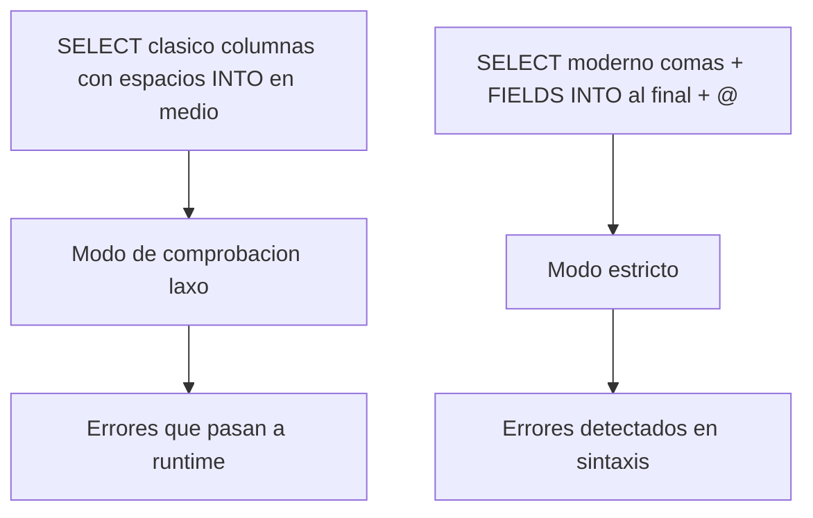

Todavía hay proyectos que escriben `SELECT` como en 2005: columnas separadas por espacios, `INTO` en medio de la sentencia y variables ABAP metidas sin marcar. Funciona, sí. Y también arrastra un modo de comprobación laxo que deja pasar cosas que un sistema HANA moderno debería rechazar de plano. La sintaxis moderna de ABAP SQL no es maquillaje: **es el interruptor que activa el modo estricto del comprobador**.

## Las cuatro reglas que cambian todo

- **Comas entre columnas**: `carrid, connid, price` en lugar de columnas separadas por espacios. Sin comas no hay sintaxis nueva.
- **La cláusula `INTO` va al final**. Desde 7.40 SP08, `INTO` se coloca después del resto de cláusulas, porque `INTO` no es parte del estándar SQL: define el puente entre SQL y ABAP. Sacarlo del bloque SQL es lo que permite añadir `UNION`, `WITH` y demás.
- **Declaración en línea con `@DATA(...)`**: declaras el destino en el mismo sitio donde lo escribes. El tipo lo infiere el compilador de las columnas seleccionadas.
- **Variables host con `@`**: toda variable ABAP que entra en la sentencia va prefijada con `@`. Y aquí está el premio: **al usar `@`, el comprobador pasa a modo estricto**.

## Del clásico al moderno

Mira la diferencia. Clásico, tolerante, con destino declarado a mano:

```abap
DATA: gt_flights TYPE STANDARD TABLE OF sflight.

SELECT carrid connid price
  INTO CORRESPONDING FIELDS OF TABLE gt_flights
  FROM sflight
  UP TO 5 ROWS.
```

Moderno, con comas, `@DATA` e `INTO` al final:

```abap
SELECT FROM sflight
  FIELDS carrid, connid, price, fldate
  INTO TABLE @DATA(gt_flights)
  UP TO 5 ROWS.

IF sy-subrc = 0.
  cl_demo_output=>display( gt_flights ).
ENDIF.
```

No solo son menos líneas. Es que `gt_flights` nace tipada exactamente a las columnas del `FIELDS`, sin una definición `TYPES` que se desincroniza en cuanto alguien toca la proyección.

## La cláusula FIELDS y el orden mental correcto

La forma `SELECT FROM ... FIELDS ...` pone el `FROM` primero, y eso no es capricho: el editor ya sabe de qué tabla hablas cuando escribes las columnas, así que el autocompletado funciona de verdad. Si prefieres las columnas antes del `FROM`, también vale, pero entonces no puedes usar `FIELDS`. Elige una y sé coherente.



## Por qué el modo estricto es un regalo, no una molestia

El modo estricto que dispara la `@` no es burocracia del comprobador. Es la diferencia entre que un desajuste de tipos te salte en la comprobación de sintaxis (gratis, en tu pantalla) o en producción (caro, en el log de dumps). Cada variable host marcada con `@` es una promesa verificada de que ABAP y la base de datos hablan del mismo tipo.

> Escribir `@` cuesta un carácter. No escribirlo cuesta la comprobación estricta que hubiera cazado el error antes de transportar.

En el próximo post: por qué un `JOIN` en la base de datos deja en ridículo a un bucle anidado con `SELECT` dentro, y qué le hace eso al plan de ejecución en HANA.
