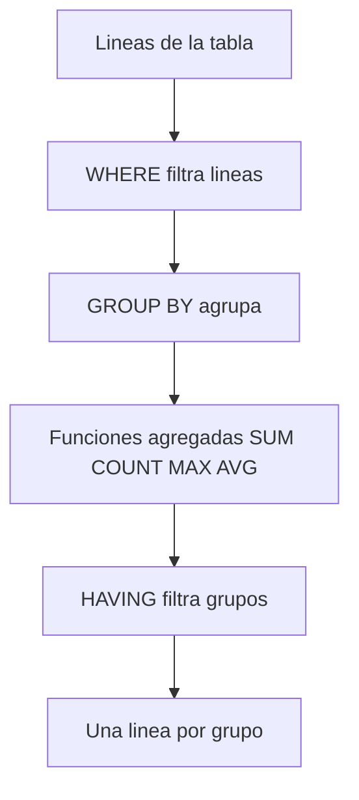

Sumar importes en un `LOOP` con una variable acumuladora es un clásico que sigue vivo. El problema no es que esté mal escrito: es que **traes diez mil líneas de la base para producir tres números**. La agregación es el trabajo natural de una base de datos columnar como HANA. Pídele el total y te lo devuelve calculado; no te lo lleves crudo para sumarlo tú.

## El antipatrón: acumular en ABAP

```abap
" NO hacer esto
SELECT FROM sflight
  FIELDS carrid, price
  INTO TABLE @DATA(gt_flights).

LOOP AT gt_flights INTO DATA(ls_flight).
  " acumular por carrid en una tabla auxiliar...
ENDLOOP.
```

Cada línea de vuelo cruza la red para acabar convertida en una suma. Es red malgastada, memoria malgastada y código que otro tendrá que leer.

## GROUP BY: agrupar y agregar en un viaje

Con `GROUP BY` agrupas por las columnas que quieras y aplicas funciones de agregación en el mismo `SELECT`. La base devuelve una línea por grupo, ya con los totales:

```abap
SELECT FROM sflight
  FIELDS carrid,
         connid,
         COUNT(*)      AS num_vuelos,
         SUM( price )  AS ingreso_total,
         MAX( price )  AS precio_max,
         AVG( price AS DEC( 15,2 ) ) AS precio_medio
  GROUP BY carrid, connid
  ORDER BY carrid, connid
  INTO TABLE @DATA(gt_totales).

cl_demo_output=>display( gt_totales ).
```

Regla de oro del `GROUP BY`: **toda columna del `FIELDS` que no esté dentro de una función de agregación tiene que aparecer en el `GROUP BY`**. Si la olvidas, el comprobador te para. No es una molestia: es la garantía de que el resultado tiene sentido.

## HAVING: filtrar sobre el agregado

`WHERE` filtra líneas antes de agrupar. Para filtrar sobre el resultado de la agregación existe `HAVING`, y confundirlos es un error frecuente:

```abap
SELECT FROM sflight
  FIELDS carrid, SUM( price ) AS ingreso_total
  WHERE fldate >= @lv_desde
  GROUP BY carrid
  HAVING SUM( price ) > @lv_umbral
  ORDER BY ingreso_total DESCENDING
  INTO TABLE @DATA(gt_top).
```

`WHERE fldate >= ...` descarta vuelos antiguos antes de sumar; `HAVING SUM( price ) > ...` descarta transportistas que no llegan al umbral después de sumar. Cada filtro en su sitio.



## Detalles que ahorran disgustos

- `AVG` conviene tiparlo con `AS DEC( len, dec )`: sin especificar precisión, la media te puede sorprender.
- `COUNT(*)` cuenta filas; `COUNT( DISTINCT col )` cuenta valores distintos. No son lo mismo.
- Un `GROUP BY` no garantiza orden: si quieres orden, pon `ORDER BY` explícito.

> Agregar en la base no es una optimización de experto. Es negarte a transportar diez mil líneas cuando el negocio solo pidió tres totales.

En el próximo post: CTEs con `WITH` y subconsultas, para encadenar pasos de consulta legibles sin ensuciar el modelo con vistas de usar y tirar.
