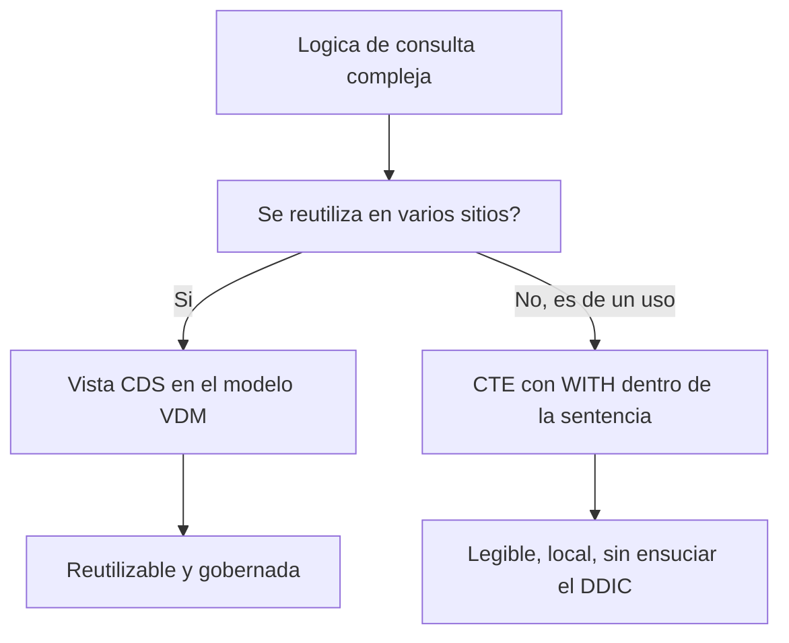

Cuando una consulta crece, la tentación es partir un `SELECT` de tres niveles en subselects anidados ilegibles, o peor, crear una vista CDS solo para usarla una vez y dejarla ahí para siempre. ABAP SQL tiene una tercera vía desde 7.51: la **Common Table Expression** (`WITH`). Descompones la consulta en pasos con nombre que viven dentro de la propia sentencia, se leen de arriba abajo y no ensucian el diccionario.

## Qué es una CTE

Una `WITH` define uno o varios conjuntos de resultados temporales (las CTE) que la consulta principal usa como si fueran tablas. Cada CTE tiene nombre propio, y ese nombre debe empezar por el carácter `+`. No es decorativo: **el `+` es parte del nombre y el comprobador lo exige**.

```abap
WITH +tmp_table AS (
  SELECT FROM scarr
    FIELDS carrname, CAST( '-' AS CHAR( 4 ) ) AS connid,
           '-' AS cityfrom, '-' AS cityto
    WHERE carrid = 'LH'
  UNION
  SELECT FROM spfli
    FIELDS '-' AS carrname, CAST( connid AS CHAR( 4 ) ) AS connid,
           cityfrom, cityto
    WHERE carrid = 'LH' )

  SELECT FROM +tmp_table
    FIELDS *
    ORDER BY carrname DESCENDING, connid, cityfrom, cityto
    INTO TABLE @DATA(lt_result)
    UP TO 10 ROWS.

cl_demo_output=>display( lt_result ).
```

Aquí la CTE `+tmp_table` combina cabeceras y trayectos con un `UNION`, y la consulta principal solo lee de ella. La lógica queda en un bloque con nombre, no repartida en subselects.

## El detalle del ENDWITH

Si el destino de la consulta principal no es una tabla interna (es decir, no hay `INTO TABLE`), la `WITH ... SELECT` abre un bucle que tienes que cerrar con `ENDWITH`, igual que un `ENDSELECT` cierra un `SELECT` de línea. Con `INTO TABLE @DATA(...)` no hace falta, porque la asignación es de conjunto completo. Es la fuente número uno de dumps de principiante con CTEs: olvidar el `ENDWITH` cuando toca.

## Cuándo CTE y cuándo vista CDS



La regla es simple y tiene opinión: si esa lógica la van a consumir varios programas o servicios, merece una vista CDS bien nombrada en el VDM. Si es intermedia y solo la usa esta consulta, una CTE la mantiene local y a la vista, sin crear un objeto de diccionario que nadie recordará para qué servía.

## Subconsultas: el mismo espíritu, otra forma

Una subconsulta clásica (un `SELECT` dentro de un `WHERE` con `IN` o `EXISTS`) sigue siendo válida y muchas veces es lo más directo para un filtro correlacionado. La diferencia es de legibilidad: cuando encadenas dos o tres pasos, la CTE gana porque cada paso tiene nombre y se lee en orden, mientras que los subselects anidados te obligan a leer de dentro hacia afuera.

> Una CTE no es una vista pobre: es una vista que no necesitaba existir en el diccionario. Usarla evita el cementerio de vistas CDS de un solo uso.

En el próximo post: host expressions y protección contra inyección, o por qué la `@` no es solo sintaxis sino tu primera línea de defensa.
