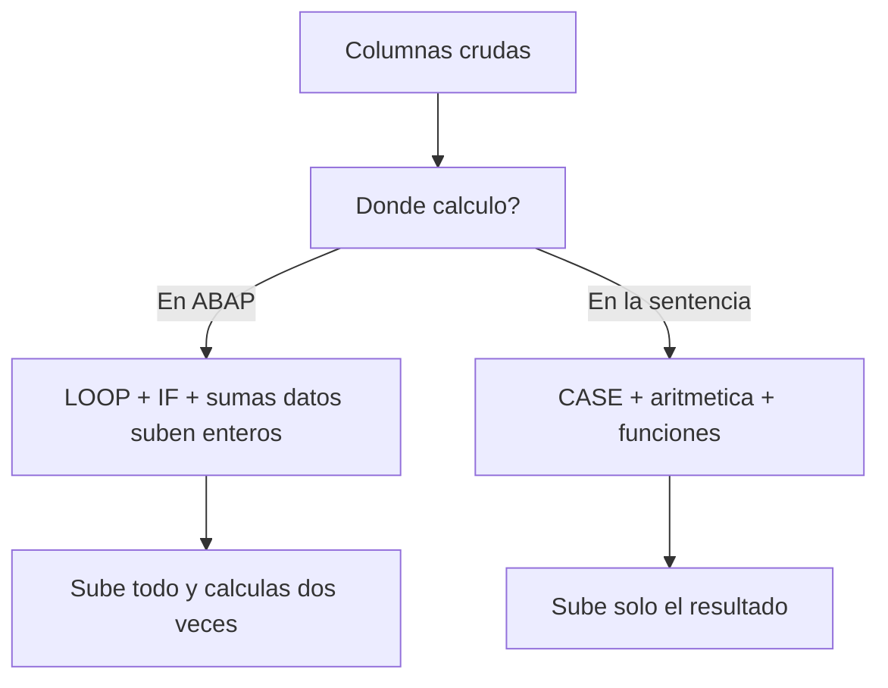

El reflejo clásico es leer las columnas crudas y luego, en ABAP, montar un `LOOP` con `IF`, sumas y clasificaciones. Cada una de esas operaciones es cálculo que podrías haber pedido en la propia sentencia. ABAP SQL trae **expresiones dentro del `SELECT`**: comparas, calculas, clasificas y formateas en la base de datos, y a ABAP solo llega el resultado ya masticado. Eso es code pushdown de verdad, no un eslogan.

## CASE: clasificar sin subir los datos

El `CASE` complejo evalúa condiciones en orden y devuelve el resultado del primer `WHEN` verdadero. Clasificar registros en grupos deja de ser un bucle ABAP:

```abap
SELECT FROM demo_expressions
  FIELDS num1, num2,
    CASE WHEN num1 < 50 AND num2 < 50 THEN @lc_ambos_menor
         WHEN num1 > 50 AND num2 > 50 THEN @lc_ambos_mayor
         WHEN num1 = 50 AND num2 = 50 THEN @lc_ambos_igual
         ELSE @lc_otro
    END AS grupo
  ORDER BY grupo
  INTO TABLE @DATA(lt_results).
```

Fíjate en un detalle que marca la diferencia: los literales de resultado (`@lc_ambos_menor`, etc.) son constantes host prefijadas con `@`, no cadenas sueltas. Si no hay `ELSE`, el resultado por defecto es el valor nulo, no una cadena vacía. Piénsalo antes de omitirlo.

## Aritmética y funciones numéricas en la sentencia

Divisiones, redondeos, módulos, valores absolutos: todo cabe en el `FIELDS`. Y cuando divides enteros, el `CAST` a `FLTP` evita que te quedes sin decimales:

```abap
SELECT SINGLE FROM demo_expressions
  FIELDS id, num1, num2,
    CAST( num1 AS FLTP ) / CAST( num2 AS FLTP ) AS ratio,
    division( num1, num2, 2 ) AS division,
    div( num1, num2 ) AS div,
    mod( num1, num2 ) AS mod,
    num1 + num2 + @gv_offset AS sum,
    abs( num1 - num2 ) AS abs,
    round( @gv_decimal, 2 ) AS round
  WHERE num1 = 14 AND num2 = 8
  INTO @DATA(gs_results).
```

`DIVISION( a, b, dec )` te da la división redondeada a los decimales que pidas; `DIV` y `MOD` te dan cociente y resto enteros. No hay razón para bajar `num1` y `num2` a ABAP solo para dividirlos.

## Funciones de cadena: formatear donde están los datos

Concatenar, recortar, rellenar, cambiar mayúsculas: la base lo hace en el mismo viaje.

```abap
SELECT SINGLE FROM demo_expressions
  FIELDS id, char1, char2,
    concat( char1, char2 ) AS concat,
    lpad( char2, 18, '0' ) AS lpad,
    replace( char1, 'DD', '__' ) AS replace,
    substring( char1, 3, 2 ) AS substring,
    upper( char1 ) AS upper,
    char1 && char2 && 'HANA-' && @lv_char AS ampersand
  WHERE id = 'L'
  INTO @DATA(ls_result).
```

El operador `&&` concatena operandos adyacentes; ojo, recorta espacios finales y el resultado no debe pasar de 255 caracteres. Para casos con espacios controlados, `CONCAT_WITH_SPACE`.



## La regla mental

Antes de escribir un `LOOP` para transformar, pregúntate si esa transformación cabe en el `SELECT`. Clasificaciones, importes calculados, cadenas formateadas: casi siempre caben. Cuanto más resuelvas en la base, menos datos viajan y menos código ABAP hay que mantener.

> Cada `IF` que mueves a un `CASE` es una línea menos de lógica en ABAP y un dato menos que cruza la red. Se paga solo.

En el próximo post: agregaciones y `GROUP BY`, para que la base te devuelva los totales ya sumados en vez de una montaña de líneas que tú sumas a mano.
