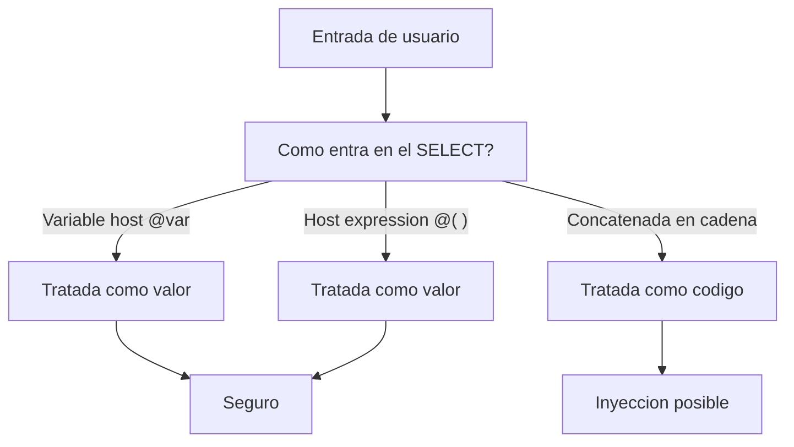

La inyección SQL no es un problema de aplicaciones web ajenas a SAP. Cada vez que construyes una sentencia concatenando texto que viene del usuario, has abierto la misma puerta. ABAP SQL da la herramienta para cerrarla y la lleva usando desde hace años: la **variable host** y la **host expression**, ambas marcadas con `@`. La `@` no es solo el interruptor del modo estricto que ya conoces; es también la frontera entre un valor y un trozo de código.

## Variable host: pasas un valor, no lo pegas

Una variable host es un objeto de datos ABAP que entra en la sentencia prefijado con `@`. El motor lo trata como un valor parametrizado, nunca como parte de la sintaxis SQL. Da igual lo que contenga:

```abap
DATA lv_carrid TYPE sflight-carrid VALUE 'AA'.

SELECT FROM sflight
  FIELDS carrid, connid, price
  WHERE carrid = @lv_carrid
  INTO TABLE @DATA(gt_flights).
```

Aunque `lv_carrid` llegara con basura o con una comilla maliciosa, no puede convertirse en instrucción: viaja como dato. Esa es toda la magia, y es suficiente para el 99% de los casos.

## Host expression: cálculo inline, también seguro

Cuando no tienes una variable sino una expresión (un `VALUE #( ... )`, una constante calculada), la envuelves en `@( ... )`. Es una host expression y goza de la misma protección:

```abap
INSERT demo_expressions FROM TABLE @( VALUE #(
  FOR i = 0 UNTIL i > 9 ( id   = i
                          num1 = lcl_random->get_next( )
                          num2 = lcl_random->get_next( ) ) ) ).
```

Todo lo que entra por `@( ... )` es dato parametrizado. No hay superficie para inyectar.

## El pecado: SQL dinámico por concatenación

El peligro aparece cuando abandonas el SQL estático y montas la condición como una cadena. Esto es lo que nunca debes hacer con entrada de usuario:

```abap
" NO hacer esto con datos que vienen del usuario
DATA(lv_where) = |carrid = '{ lv_input }'|.

SELECT FROM sflight
  FIELDS carrid, connid
  WHERE (lv_where)
  INTO TABLE @DATA(gt_flights).
```

Si `lv_input` trae `AA' OR '1' = '1`, tu `WHERE` se convierte en otra consulta. La condición dinámica `WHERE (lv_where)` es una herramienta legítima, pero **la cadena que le pasas jamás debe construirse concatenando entrada sin validar**.



## Si de verdad necesitas SQL dinámico

A veces el nombre de tabla o de columna es dinámico y no hay más remedio. La defensa entonces no es la `@`, sino:

- Validar la entrada contra una lista blanca de nombres permitidos, nunca aceptarla tal cual.
- Usar `cl_abap_dyn_prg` para sanear identificadores y valores antes de meterlos en la sentencia.
- Mantener parametrizado con variables host todo lo que sea un valor; reservar el dinamismo solo para la estructura que de verdad varía.

> La `@` no es solo azúcar sintáctica del comprobador estricto. Es la línea que separa pasar un dato de pegar código en tu propia consulta. Respétala y la inyección deja de ser tu problema.

Con esto cerramos la serie de ABAP SQL moderno: sintaxis, joins, expresiones, agregaciones, CTEs y seguridad. El hilo conductor es siempre el mismo: pide el trabajo en la sentencia, pásale los datos con `@`, y deja que la base haga lo que la base hace mejor.
