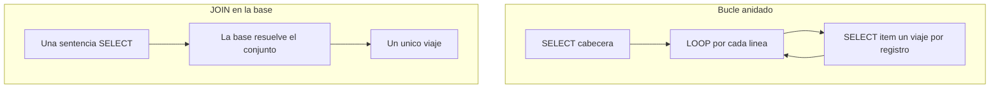

Hay un antipatrón que sobrevive a todas las modas: leer una tabla, recorrerla con `LOOP` y, dentro, lanzar un `SELECT` por cada línea. Se lee fácil, se escribe rápido y **le manda a la base de datos un viaje por registro**. Con cien líneas casi no lo notas. Con cien mil, el usuario abre un ticket. La alternativa lleva veinte años en el lenguaje: el `JOIN`.

## El antipatrón, tal cual lo verás

```abap
" NO hacer esto
SELECT FROM demo_join1
  FIELDS a, b, d
  INTO TABLE @DATA(gt_head).

LOOP AT gt_head INTO DATA(ls_head).
  SELECT SINGLE FROM demo_join2
    FIELDS e, f
    WHERE d = @ls_head-d
    INTO @DATA(ls_item).
  " ... combinar ls_head y ls_item
ENDLOOP.
```

Un `SELECT` dentro del `LOOP` significa un `round trip` a la base de datos por cada iteración. La base de datos es rapidísima resolviendo conjuntos; es lentísima atendiendo mil preguntas pequeñas de una en una. Estás usando la herramienta al revés.

## El JOIN: un viaje, un conjunto

La misma lógica, resuelta en la capa de datos, donde debe resolverse:

```abap
SELECT FROM demo_join1 AS d1
  INNER JOIN demo_join2 AS d2
    ON d1~d = d2~d
  FIELDS d1~a, d1~b, d2~e, d2~f
  INTO TABLE @DATA(gt_result).

cl_demo_output=>display( gt_result ).
```

La base de datos recibe una sola sentencia, elige su plan de ejecución, aprovecha índices y devuelve el conjunto ya combinado. El alias con `~` (`d1~d = d2~d`) deja explícito de qué tabla sale cada columna, que es exactamente lo que quieres cuando dentro de un año alguien lea esto.



## El JOIN que además escribe

El `JOIN` no se queda en leer. Puedes alimentar directamente un `INSERT` o un `MODIFY` desde una subconsulta con `JOIN`, sin materializar nada intermedio en ABAP:

```abap
INSERT demo_join3 FROM ( SELECT FROM demo_join1 AS d1
                                INNER JOIN demo_join2 AS d2
                                  ON d1~d = d2~d
                                FIELDS d1~a, d1~b, d2~e, d2~f ).
```

Esa escritura ocurre entera en la base de datos. Ni un solo registro sube a la capa ABAP para volver a bajar. Ese es el nivel de code pushdown que HANA premia.

## La honestidad que debemos: cuándo el bucle es defendible

- Cuando el conjunto exterior es diminuto y fijo (media docena de líneas de configuración), la diferencia es irrelevante y la legibilidad manda.
- Cuando necesitas lógica ABAP compleja entre lectura y lectura que no se puede expresar en SQL.

Fuera de eso, el `JOIN` gana. Y si el problema es que tienes los datos ya en una tabla interna, la respuesta moderna casi nunca es `FOR ALL ENTRIES`: son las tablas temporales globales, que sí aceptan `INNER JOIN` en la base.

> Un bucle con SELECT dentro no es un error de sintaxis. Es una factura de rendimiento aplazada que se cobra el día de la carga real.

En el próximo post: las expresiones SQL (CASE, aritmética, funciones) que empujan el cálculo a la base y vacían de lógica trivial tu código ABAP.
