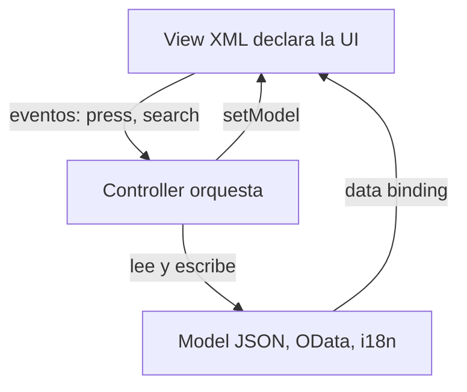

La mayoria de las apps SAPUI5 que heredamos no fallan por el framework. Fallan porque **alguien metio en el controlador todo lo que no sabia donde poner**: lógica de UI, transformación de datos, textos hardcodeados y hasta el esquema del modelo. El patrón Model-View-Controller de UI5 existe justo para evitar eso, y respetarlo cuesta menos que saltarselo.

## Las tres piezas y su unica responsabilidad

- **View (`.view.xml`)**: declara *qué* se ve. XML puro, sin lógica. Un `<Button>`, un `<List>`, un binding. Si estas escribiendo un `if` en la vista, algo va mal.
- **Controller (`.controller.js`)**: reacciona a *eventos*. `onShowHello`, `onFilterInvoices`. Orquesta, no almacena estado de negocio.
- **Model**: es *el dato*. Un `JSONModel`, un `ODataModel` o el `ResourceModel` de i18n. La vista se vincula a el; el controlador lo lee y lo escribe.

La regla que nos ahorra discusiones en cada revisión de código: **la vista nunca conoce al modelo por su forma interna, solo por su binding path; el controlador nunca construye HTML.**



## El controlador como debe ser

Fijate en este controlador real: declara sus dependencias, extiende `Controller` y expone handlers cortos. Nada mas.

```javascript
sap.ui.define([
    "sap/ui/core/mvc/Controller",
    "sap/m/MessageToast",
    "sap/ui/model/json/JSONModel"
],
function (Controller, MessageToast, JSONModel) {
    "use strict";
    return Controller.extend("logaligroup.SAPUI5.controller.App", {
        onInit: function () {
            var oModel = new JSONModel({ recipient: { name: "World" } });
            this.getView().setModel(oModel);
        },
        onShowHello: function () {
            var oBundle = this.getView().getModel("i18n").getResourceBundle();
            var sRecipient = this.getView().getModel().getProperty("/recipient/name");
            MessageToast.show(oBundle.getText("helloMsg", [sRecipient]));
        }
    });
});
```

Y la vista que lo acompaña, sin una linea de lógica:

```xml
<mvc:View controllerName="logaligroup.SAPUI5.controller.App"
    xmlns="sap.m" xmlns:mvc="sap.ui.core.mvc">
    <Button text="{i18n>showHelloButtonText}" press=".onShowHello"/>
    <Input value="{/recipient/name}" valueLiveUpdate="true" width="60%"/>
</mvc:View>
```

Tres decisiones que valen oro dentro de dos años:

1. El texto del boton sale de `{i18n>...}`, no de un literal. Traducir es cambiar un `.properties`, no tocar la vista.
2. El `Input` esta vinculado a `/recipient/name`. Cambia el modelo y la UI se refresca sola, sin un solo `setText`.
3. El `press` apunta a `.onShowHello`, una función del controlador. La vista no sabe *qué* hace ese handler, solo que existe.

## El error que verás en todos los proyectos

Un `App.controller.js` de 800 lineas que formatea moneda, arma filtros, guarda estado y ademas navega. Funciona el dia de la demo y es intocable el dia del cambio. En cuanto necesites reutilizar ese formateo en otra vista, tendras que copiarlo, y ahi empieza la deuda.

> La separación MVC no es purismo academico. Es lo que permite que otro developer entre a tu app en seis meses y sepa, sin preguntarte, dónde vive cada cosa.

Cuando el modelo crece, sacalo a su propio fichero (`model/Models.js`). Cuando el formateo se repite, sacalo a un formateador. El controlador queda para lo unico que le toca: reaccionar. En el proximo post entramos en el data binding, que es lo que hace que todo esto se sienta magico.
