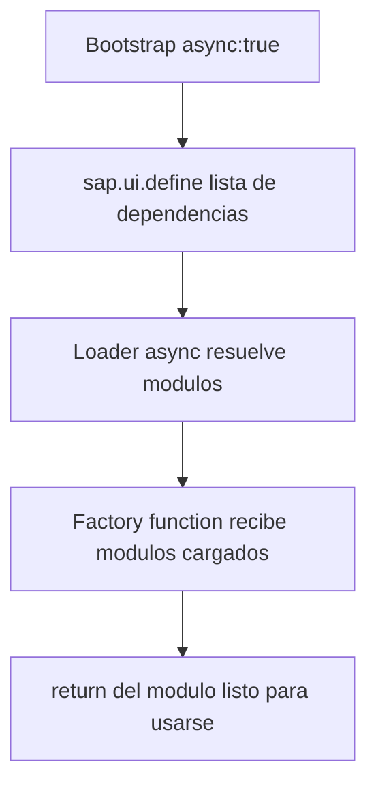

Si abres una app UI5 antigua veras `sap.ui.getCore()` colgando de una variable global, scripts que se cargan en orden fragil y un `onInit` que asume que todo ya esta en memoria. El modelo moderno de UI5 es asincrono y modular: **cada fichero declara sus dependencias con `sap.ui.define`, el framework las resuelve y solo entonces ejecuta tu código**. Nada de globales, nada de orden implicito.

## sap.ui.define: AMD para UI5

`sap.ui.define` es la implementacion AMD de UI5. Recibe un array de rutas de modulos y una funcion factoria cuyos argumentos son esos modulos ya cargados, en orden. Ese es el contrato.

```javascript
sap.ui.define([
    "sap/ui/core/mvc/Controller",
    "sap/m/MessageToast",
    "sap/ui/model/json/JSONModel"
],
function (Controller, MessageToast, JSONModel) {
    "use strict";
    return Controller.extend("logaligroup.SAPUI5.controller.App", {
        onInit: function () {
            this.getView().setModel(new JSONModel({ recipient: { name: "World" } }));
        }
    });
});
```

Tres cosas que este patron te garantiza:

1. **Dependencias explicitas**: lees el array y sabes exactamente de qué depende el fichero. No hay imports ocultos.
2. **Sin globales**: `Controller`, `MessageToast` y `JSONModel` son parametros locales. No contaminan `window`.
3. **Orden garantizado**: la factoria no corre hasta que los tres modulos estan cargados. Se acabaron los "undefined is not a function" por carga fuera de orden.



## El bootstrap: async de verdad

Todo empieza en el `index.html`. La bandera que marca la diferencia es `data-sap-ui-async="true"`: sin ella, UI5 carga en modo sincrono legacy, bloqueante y desaconsejado.

```xml
<script id="sap-ui-bootstrap"
    src="resources/sap-ui-core.js"
    data-sap-ui-theme="sap_horizon"
    data-sap-ui-resourceroots='{"logaligroup.SAPUI5": "./"}'
    data-sap-ui-async="true"
    data-sap-ui-compatVersion="edge"
    data-sap-ui-oninit="module:sap/ui/core/ComponentSupport">
</script>
```

Fijate en `data-sap-ui-oninit="module:sap/ui/core/ComponentSupport"`. En lugar de un `<script>` inline que arranca el componente a mano, delegas el arranque en `ComponentSupport`. El componente se declara con un atributo en el `<body>`:

```xml
<body class="sapUiBody" id="content">
    <div data-sap-ui-component
         data-name="logaligroup.SAPUI5"
         data-id="container"
         data-settings='{"id": "SAPUI5"}'></div>
</body>
```

## Por que esto es tambien seguridad

Aqui esta el corolario que muchos pasan por alto: **la carga sin scripts inline es lo que hace tu app compatible con Content Security Policy (CSP)**. Una CSP estricta bloquea todo JavaScript embebido en el HTML. Si tu arranque depende de un `<script>onInit()</script>`, la CSP lo mata; si depende de `ComponentSupport` y `sap.ui.define`, no hay código inline que bloquear.

> El async no es solo rendimiento. Es lo que permite que la misma app pase un audit de seguridad con CSP estricta sin reescribir el arranque.

Reglas practicas que aplicamos siempre:

- Todo fichero JS empieza por `sap.ui.define`. Nunca `sap.ui.getCore()` global, nunca `jQuery.sap`.
- Bootstrap con `data-sap-ui-async="true"` y arranque via `ComponentSupport`, no scripts inline.
- Si necesitas un modulo dentro de una funcion (no en la cabecera), usa `sap.ui.require`, la variante asincrona, no la carga sincrona.

El código moderno de UI5 es asincrono por defecto. No es una opcion avanzada: es el minimo para que tu app sea mantenible y auditable.
