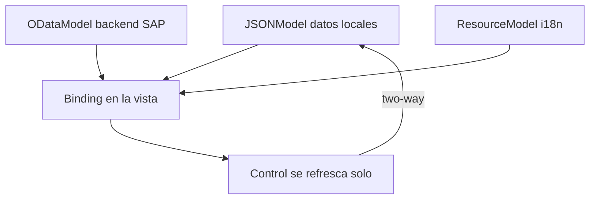

Si en tu controlador ves un `setText`, un `setValue` o un `forEach` que pinta filas a mano, estas peleando contra el framework. UI5 tiene **data binding**: declaras la relación entre dato y control una vez, y el framework mantiene los dos lados sincronizados. Ese es el corazón de la casa.

## Elige el modelo segun de dónde vengan los datos

- **`JSONModel`**: datos en cliente. Un fichero estático, una respuesta que ya tienes en memoria, estado de UI. Two-way binding gratis.
- **`ODataModel` (V2/V4)**: el backend real. Sabe de metadatos, de `$batch`, de deferred loading. No metes el JSON a mano: apuntas a un `dataSource` del manifest.
- **`ResourceModel`**: los textos i18n. Es tambien un modelo, y por eso los textos se vinculan igual que cualquier dato.

Los modelos con nombre (`{invoices>...}`, `{i18n>...}`) evitan colisiones. El modelo sin nombre es el por defecto de la vista.



## Los cuatro tipos de binding que usaras a diario

**Aggregation binding**: vincula una lista a una coleccion. Cada item se repite por el template.

```xml
<List items="{invoices>/Invoices}">
    <items>
        <ObjectListItem title="{invoices>Quantity} x {invoices>ProductName}"/>
    </items>
</List>
```

**Property binding con tipo**: no formatees moneda a mano. Declara el tipo y UI5 lo hace bien, con locale incluido.

```xml
<ObjectListItem
    number="{ parts: [ {path: 'invoices>ExtendedPrice'}, {path: 'currency>/usd'} ],
              type: 'sap.ui.model.type.Currency',
              formatOptions: { showMeasure: false } }"
    numberUnit="{currency>/usd}"/>
```

**Expression binding**: lógica sencilla inline, sin ensuciar el controlador.

```xml
<ObjectListItem
    numberState="{= ${invoices>ExtendedPrice} > 50 ? 'Success' : 'Error' }"/>
```

**Formateador personalizado**: cuando la regla no cabe en una expresión, un modulo dedicado. Reutilizable, testeable.

```javascript
sap.ui.define([], function () {
    return {
        invoiceStatus: function (sStatus) {
            var oBundle = this.getView().getModel("i18n").getResourceBundle();
            switch (sStatus) {
                case "A": return oBundle.getText("invoiceStatusA");
                case "B": return oBundle.getText("invoiceStatusB");
                case "C": return oBundle.getText("invoiceStatusC");
                default:  return sStatus;
            }
        }
    };
});
```

## El salto a OData es solo cambiar la fuente

Lo elegante del diseño: pasar de datos locales a backend real casi no toca la vista. En el manifest defines el modelo una vez y la vista sigue vinculada igual, solo cambia el nombre del modelo de `invoices` a `northwind`.

```json
"models": {
    "northwind": {
        "dataSource": "mainService",
        "preload": true,
        "settings": {
            "defaultBindingMode": "TwoWay",
            "defaultCountMode": "Inline"
        }
    }
}
```

> El binding declarativo no es azucar sintactico. Es la diferencia entre una UI que se mantiene sola y un controlador que reescribes cada vez que cambia un requisito.

Filtrar tampoco es recorrer arrays: pides al binding que filtre y el resto es cosa del framework.

```javascript
onFilterInvoices: function (oEvent) {
    var aFilter = [];
    var sQuery = oEvent.getParameter("query");
    if (sQuery) {
        aFilter.push(new Filter("ProductName", FilterOperator.Contains, sQuery));
    }
    this.getView().byId("invoiceList").getBinding("items").filter(aFilter);
}
```

La regla practica: si te encuentras escribiendo código para mover un valor del dato al control, para y pregunta cual de estos cuatro bindings te lo hace gratis. Casi siempre hay uno.
