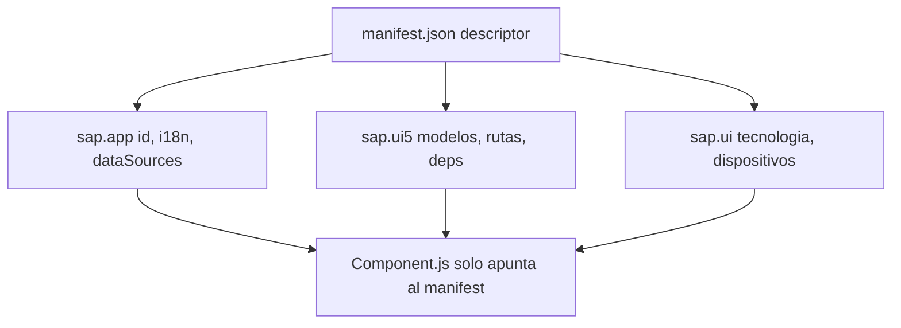

Hay dos formas de construir una app SAPUI5. La primera es instanciar cada modelo, cada ruta y cada bundle i18n a mano en el `Component.js`. La segunda es **declararlo todo en el `manifest.json` y dejar que el framework lo monte**. La segunda es la que SAP recomienda, la que entienden las herramientas de Fiori y la que no te avergonzara en el proximo upgrade.

## Qué es el descriptor y por qué manda

El `manifest.json` (el Descriptor for Applications, o `descriptor`) es el contrato de tu app: qué es, de qué depende, qué modelos usa y cómo navega. El `Component.js` se limita a apuntar a el.

```javascript
sap.ui.define([
    "sap/ui/core/UIComponent"
], function (UIComponent) {
    "use strict";
    return UIComponent.extend("logaligroup.SAPUI5.Component", {
        metadata: {
            manifest: "json"
        },
        init: function () {
            UIComponent.prototype.init.apply(this, arguments);
            this.getRouter().initialize();
        }
    });
});
```

Ese `manifest: "json"` es la linea clave: le dice a UI5 que lea el descriptor y construya modelos, rutas y dependencias por ti. El componente queda limpio.



## Las tres secciones que importan

El descriptor se organiza en tres namespaces. Cada uno responde a una pregunta distinta.

```json
{
    "_version": "1.12.0",
    "sap.app": {
        "id": "logaligroup.SAPUI5",
        "type": "application",
        "i18n": "i18n/i18n.properties",
        "dataSources": {
            "mainService": {
                "uri": "Northwind/V2/Northwind/Northwind.svc/",
                "type": "OData",
                "settings": { "odataVersion": "2.0" }
            }
        }
    },
    "sap.ui": {
        "technology": "UI5",
        "deviceTypes": { "desktop": true, "tablet": true, "phone": true }
    },
    "sap.ui5": {
        "rootView": {
            "viewName": "logaligroup.SAPUI5.view.App",
            "type": "XML", "async": true, "id": "App"
        },
        "dependencies": {
            "minUI5Version": "1.60.1",
            "libs": { "sap.ui.core": {}, "sap.m": {}, "sap.ui.layout": {} }
        },
        "models": {
            "i18n": {
                "type": "sap.ui.model.resource.ResourceModel",
                "settings": { "bundleName": "logaligroup.SAPUI5.i18n.i18n" }
            }
        }
    }
}
```

Lo que ganas al declararlo aqui en lugar de en código:

- **`sap.app`**: identidad, textos y `dataSources`. Los servicios OData se nombran una vez y se referencian desde `models`, no se repiten URLs por el proyecto.
- **`sap.ui`**: tecnologia y tipos de dispositivo. Aqui vive el soporte responsive declarado.
- **`sap.ui5`**: el corazón. `rootView`, `dependencies` con `minUI5Version` (el checker te avisa si usas API de una version superior), `models` y el bloque `routing`.

## El error que pagas en el upgrade

Instanciar el `ResourceModel` y el `ODataModel` en el `init` del componente parece inocente. Pero entonces la version minima de UI5, las libs y las fuentes de datos quedan dispersas por el JavaScript, invisibles para las herramientas. El dia que Fiori Tools o el linter necesiten leer tu app, no encuentran nada.

> El manifest no es burocracia de configuración. Es lo que convierte tu app en algo que las herramientas de SAP entienden sin ejecutar una linea de tu código.

Regla practica: si estas escribiendo `new JSONModel(...)` o `new ResourceModel(...)` en el `Component.js`, pregunta si no deberia ser una entrada en `models`. Casi siempre si. El componente es para orquestar el arranque, no para configurar la app.
