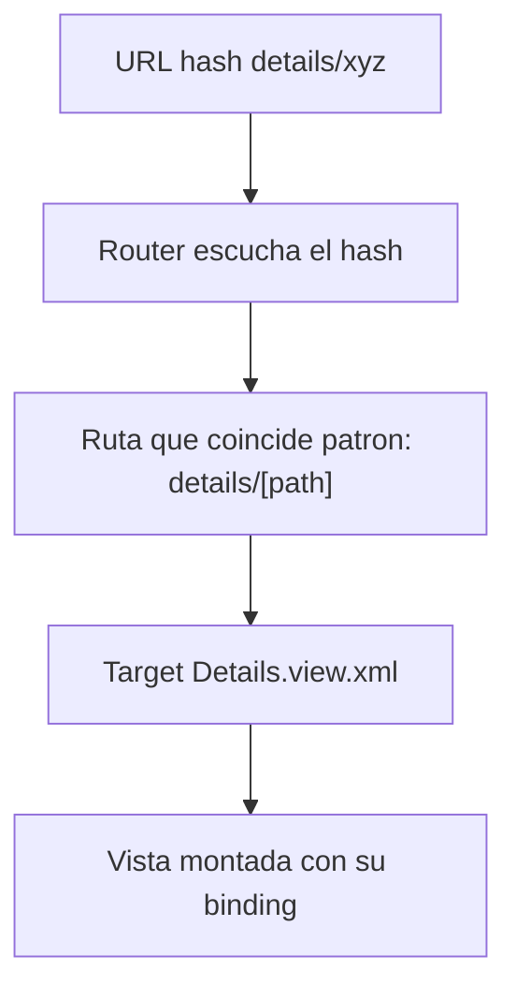

La navegacion casera en UI5 tiene un olor caracteristico: un monton de `setVisible(true)` y `setVisible(false)` para ocultar y mostrar paginas. Funciona hasta que el usuario pulsa Atras en el navegador, o comparte un enlace, o recarga. El **router** de UI5 resuelve exactamente eso: vincula el hash de la URL a una vista, y la navegacion se vuelve declarativa.

## El modelo mental: hash, ruta y target

- **Ruta (`route`)**: un patron de URL. `""` es la home; `details/{invoicePath}` captura un parametro.
- **Target**: la vista que se muestra cuando esa ruta coincide.
- **Router**: el objeto que escucha el hash y monta el target correcto.

Lo declaras todo en el `manifest.json`, y el componente solo lo inicializa.



## Declarar rutas en el descriptor

Dos rutas: la vista general en la raiz y el detalle con un parametro en el patron.

```json
"routing": {
    "config": {
        "routerClass": "sap.m.routing.Router",
        "viewType": "XML",
        "controlId": "app",
        "controlAggregation": "pages",
        "async": true
    },
    "routes": [
        { "name": "RouteApp", "pattern": "",                    "target": ["TargetOverview"] },
        { "name": "Details",  "pattern": "details/{invoicePath}", "target": ["TargetDetails"] }
    ],
    "targets": {
        "TargetOverview": { "viewName": "Overview", "viewId": "Overview" },
        "TargetDetails":  { "viewName": "Details",  "viewId": "Details" }
    }
}
```

El componente arranca el router en su `init`, una sola linea:

```javascript
this.getRouter().initialize();
```

## Navegar con un parametro

Desde la lista, al pulsar un item, pides al router que vaya a `Details` pasando el path del contexto vinculado. Nada de estado global: la URL lleva la informacion.

```javascript
navigateToDetails: function (oEvent) {
    var oItem = oEvent.getSource();
    var oRouter = sap.ui.core.UIComponent.getRouterFor(this);
    oRouter.navTo("Details", {
        invoicePath: window.encodeURIComponent(
            oItem.getBindingContext("northwind").getPath().substr(1)
        )
    });
}
```

Y en el detalle, escuchas el `patternMatched` para vincular la vista al objeto que llega en la URL. La vista se rellena sola por binding.

```javascript
onInit: function () {
    var oRouter = sap.ui.core.UIComponent.getRouterFor(this);
    oRouter.getRoute("Details").attachPatternMatched(this._onObjectMatch, this);
},
_onObjectMatch: function (oEvent) {
    this.getView().bindElement({
        path: "/" + window.decodeURIComponent(oEvent.getParameter("arguments").invoicePath),
        model: "northwind"
    });
}
```

## La navegacion de regreso que no rompe el navegador

Aqui esta la diferencia entre una app amateur y una profesional. No hagas `navTo` a la home sin mas: consulta el historial. Si el usuario llego desde dentro de la app, `history.go(-1)` respeta su recorrido; si entro por enlace directo, entonces si navegas a la raiz.

```javascript
onNavBack: function () {
    var oHistory = History.getInstance();
    if (oHistory.getPreviousHash() !== undefined) {
        window.history.go(-1);
    } else {
        UIComponent.getRouterFor(this).navTo("RouteApp", {}, true);
    }
}
```

> Cuando la navegacion vive en la URL, el boton Atras del navegador, los enlaces compartidos y el deep linking funcionan gratis. Cuando vive en `setVisible`, no funciona ninguno.

Regla practica: si tu app tiene mas de una pantalla, no hay excusa para no usar el router. El coste de declarar dos rutas en el manifest es de cinco minutos; el coste de no hacerlo es cada bug de navegacion que aparezca despues.
