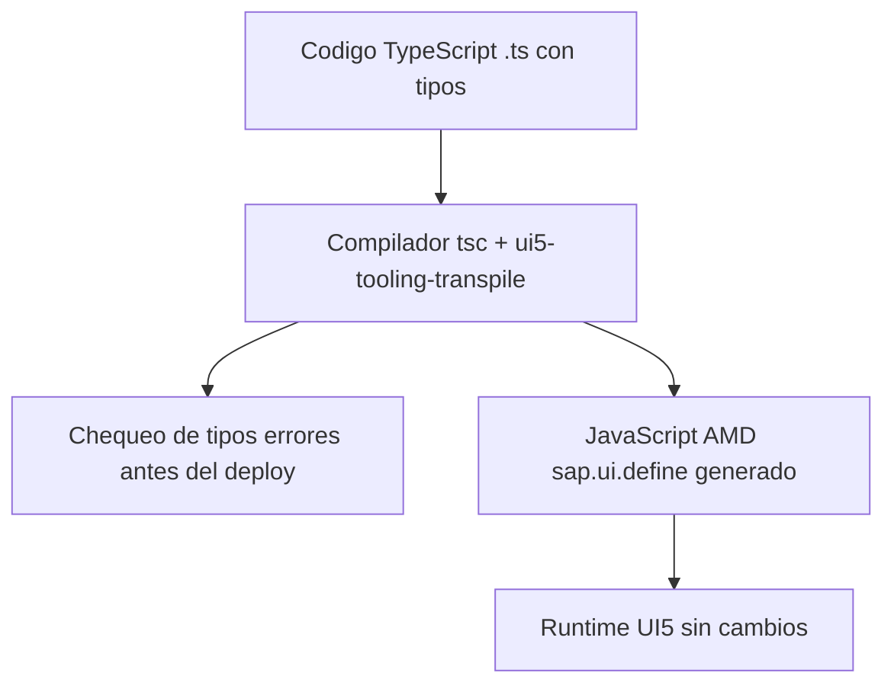

Abre casi cualquier controlador UI5 de los ultimos anos y encontraras esto en la primera linea: `// @ts-nocheck`, seguido de bloques JSDoc que declaran los tipos de las dependencias a mano.

```javascript
// @ts-nocheck
sap.ui.define([
    "sap/ui/core/mvc/Controller",
    "sap/m/MessageToast"
],
/**
 * @param {typeof sap.ui.core.mvc.Controller} Controller
 * @param {typeof sap.m.MessageToast} MessageToast
 */
function (Controller, MessageToast) {
    "use strict";
    return Controller.extend("app.controller.App", {});
});
```

Esos `@param {typeof ...}` no son decoracion: son un intento de recuperar el tipado que el JavaScript no da. TypeScript convierte ese apano en algo real, y el `@ts-nocheck` desaparece.

## Qué gana un proyecto UI5 con TypeScript

- **Autocompletado real**: el editor conoce la API de UI5 completa via `@sapui5/types`. Escribes `oView.` y ves los metodos, no adivinas.
- **Errores en compilacion, no en runtime**: llamar a un metodo que no existe o pasar el tipo equivocado se detecta antes de desplegar.
- **Refactor seguro**: renombrar una funcion o cambiar una firma propaga los errores por todo el proyecto al instante.



## El mismo controlador, en TypeScript

Fijate en la diferencia: las dependencias son `import` ES6, la clase extiende `Controller` de verdad, y no hay ni un JSDoc de tipos porque el compilador ya los conoce.

```typescript
import Controller from "sap/ui/core/mvc/Controller";
import MessageToast from "sap/m/MessageToast";
import JSONModel from "sap/ui/model/json/JSONModel";

/**
 * @namespace logaligroup.SAPUI5.controller
 */
export default class App extends Controller {
    public onInit(): void {
        this.getView()?.setModel(new JSONModel({ recipient: { name: "World" } }));
    }
    public onShowHello(): void {
        MessageToast.show("Hello World");
    }
}
```

El `?.` en `getView()?.` no es capricho: TypeScript sabe que `getView()` puede devolver `undefined` y te obliga a contemplarlo. Eso es exactamente el tipo de bug que el JavaScript te dejaba pasar hasta el runtime.

## El detalle que marca el codigo profesional: eventos tipados

Desde UI5 1.115, cada control expone tipos para sus eventos. En lugar de un `oEvent` opaco del que no sabes nada, importas el tipo exacto y el `getParameter` te devuelve el valor correcto.

```typescript
import Button$PressEvent from "sap/m/Button$PressEvent";
import SearchField$SearchEvent from "sap/m/SearchField$SearchEvent";

public onFilterInvoices(oEvent: SearchField$SearchEvent): void {
    const sQuery: string = oEvent.getParameter("query");
    // sQuery es string, garantizado por el compilador
}
```

> El JSDoc `@param {typeof ...}` era un parche para simular lo que TypeScript hace nativo. Cuando el andamiaje que pusiste para compensar la falta de tipos ya es mas trabajo que adoptar los tipos de verdad, es hora de migrar.

## Como dar el salto sin drama

No hace falta reescribir la app de golpe. El planteamiento que funciona:

1. Anade `@sapui5/types` y `ui5-tooling-transpile` al proyecto. El transpilador convierte tu `.ts` en el `sap.ui.define` que el runtime espera.
2. Migra fichero a fichero: un controlador nuevo en `.ts`, los viejos en `.js` conviven sin problema.
3. En cada migracion, borra el `@ts-nocheck` y deja que el compilador te ensene lo que estaba mal.

TypeScript en UI5 ya no es experimental: es la direccion oficial de SAP para desarrollo nuevo. El coste de aprenderlo se paga en la primera tarde que el compilador te evita un despliegue roto.
