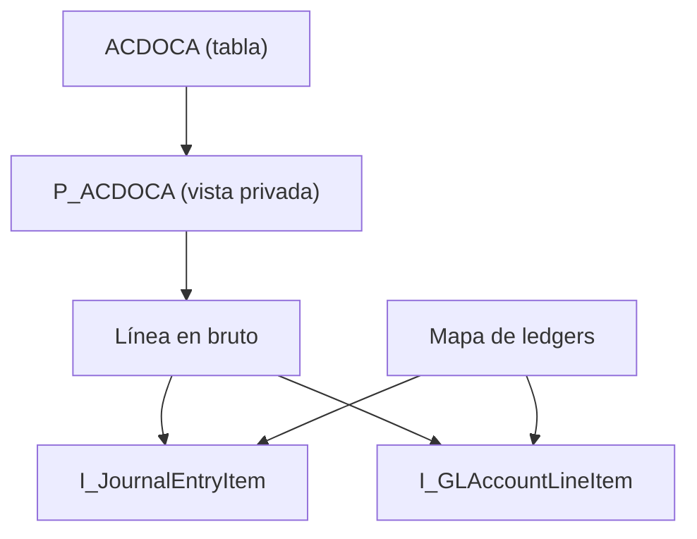

El Universal Journal de SAP S/4HANA se guarda en una sola tabla, ACDOCA. En SAP S/4HANA 2025 tiene 545 entradas en el diccionario, de las cuales 41 son includes: 504 columnas reales. Leerla directamente parece el camino más corto, y es precisamente el que SAP descarta de forma expresa. El motivo no es solo formal: la tabla no contiene toda la información que muestra la contabilidad.

Este artículo abre la serie SAP FI Journal Entry con el inventario de las vistas CDS liberadas que sustituyen a ACDOCA, la necesidad que cubre cada una y los límites que conviene conocer antes de construir encima. Todos los estados de liberación, fragmentos de código y resultados proceden de un sistema SAP S/4HANA 2025 y se han comprobado el 30 de septiembre de 2026.

## Por qué no se lee ACDOCA directamente

La pestaña **API State** de ADT muestra para ACDOCA el contrato C1, el que habilita el desarrollo de cliente, en estado **Not to Be Released**: SAP no la va a liberar. En la misma pestaña indica las sucesoras que deben usarse en su lugar: `I_JournalEntryItem`, `I_GLAccountLineItem` e `I_GLAccountLineItemRawData`. BSEG recibe el mismo tratamiento, con una única sucesora: `I_OperationalAcctgDocItem`.

La lectura directa de la tabla tiene tres consecuencias:

1. **No es utilizable en ABAP Cloud.** Un objeto sin liberar no puede usarse con la versión de lenguaje ABAP for Cloud Development: la comprobación de sintaxis lo rechaza.
2. **No aplica los controles de acceso.** `I_GLAccountLineItemRawData`, `I_JournalEntryItem` e `I_GLAccountLineItem` declaran `@AccessControl.authorizationCheck: #CHECK`. Una lectura de la tabla no pasa por esas reglas de autorización.
3. **Devuelve datos incompletos.** La tabla solo contiene lo contabilizado físicamente. Un ledger de extensión guarda únicamente sus propios apuntes, y lo que hereda de su ledger base no está en ACDOCA. En el sistema de prueba, la consulta `SELECT ... FROM acdoca WHERE rldnr = '0E'` devuelve cero filas, mientras que la vista liberada devuelve para ese mismo ledger todas las líneas que hereda.

## La pila de vistas CDS liberadas del Journal Entry

La tabla se lee en un único punto. Todo lo demás se apoya en capas:



- `P_ACDOCA` es la vista privada de SAP que lee la tabla. No se consume.
- `I_GLAccountLineItemRawData`, la línea en bruto del diagrama, expone los nombres de negocio (`CompanyCode`, `GLAccount`, `AmountInCompanyCodeCurrency`) y el control de autorización, pero **no resuelve los ledgers de extensión**. SAP lo deja escrito en la cabecera de la propia vista:

```cds
// Documentation: This view does not implement the logic for extension ledgers
// Result will be incomplete for ledgers other than basis ledgers
// For correct data of all ledgers use
// I_JournalEntryItem (change flows)
// I_GLAccountLineItem (for calculation of balances of Balance Sheet Accounts (includes BCF for GL Account Balances calculation)
```

- `I_JournalEntryItem` e `I_GLAccountLineItem` añaden la correspondencia entre cada ledger y los ledgers de los que hereda. La obtienen de `I_CoCodeLedgerSourceLedger`, el mapa de ledgers del diagrama. Son las dos vistas de uso general.

## Qué vista usar para cada necesidad

| Necesidad | Vista | Motivo |
|---|---|---|
| Partidas, cuenta de resultados, movimientos del período | `I_JournalEntryItem` | Grano de línea del diario, con los ledgers de extensión resueltos. No incluye el arrastre de saldos |
| Saldos de cuentas de balance | `I_GLAccountLineItem` | Misma lógica de ledgers e incluye el arrastre de saldos |
| Datos de cabecera del documento | `I_JournalEntry` | Un registro por documento contable |
| Partidas abiertas, compensaciones, vencimientos | `I_OperationalAcctgDocItem` | Documento operativo; sucesora de BSEG |
| Comparación de real y plan | `I_ActualPlanJournalEntryItem` | Real y plan en el mismo grano |
| Documentos periódicos | `I_RecurringJournalEntry` | Plantillas de contabilización recurrente |
| Correspondencia entre ledgers | `I_LedgerSourceLedger` | Qué ledgers de origen alimenta cada ledger |
| Consulta analítica o aplicación de usuario clave | `I_JournalEntryItemCube`, `I_GLAccountLineItemCube` | Modelos de cubo. No disponibles en ABAP Cloud |
| Saldos para el motor analítico | `I_GLAccountBalance` | Cubo virtual. No se consulta con SQL |

Todas las vistas de las siete primeras filas aparecen en el catálogo de objetos liberados para desarrollo cloud del sistema. Las de las dos últimas filas están liberadas con otras condiciones, que se explican a continuación.

## Tres diferencias que deciden la elección

### 1. Los ledgers de extensión

`I_GLAccountLineItemRawData` solo devuelve lo que está en la tabla. `I_JournalEntryItem` e `I_GLAccountLineItem` proyectan cada línea una vez por cada ledger que la incluye: el ledger en el que se contabilizó y cada ledger de extensión que hereda de él. En el sistema de prueba, un asiento de dos posiciones ocupa 4 filas en ACDOCA (ledgers 0L y 2L) y 8 filas en `I_JournalEntryItem` (ledgers 0C, 0E, 0L y 2L).

Por eso la clave de la vista lleva dos campos de ledger, `Ledger` y `SourceLedger`, y el filtro que se aplique sobre ellos decide si el importe es correcto, se duplica o se triplica. El siguiente artículo de la serie desarrolla ese caso con todas las variantes medidas.

### 2. El arrastre de saldos

`I_JournalEntryItem` excluye de forma expresa el arrastre de saldos. Su condición es esta:

```cds
where ( I_GLAccountLineItemRawData.FiscalPeriod > '000' ) or
      ( I_GLAccountLineItemRawData.FiscalPeriod = '000'  and ( I_GLAccountLineItemRawData.AccountingDocumentCategory = 'J' or I_GLAccountLineItemRawData.AccountingDocumentCategory = 'L' ) )
```

El comentario que la acompaña lo precisa: la vista no lee el período 000 con categoría de documento `C`, que es el arrastre de saldos. En consecuencia, un saldo de balance calculado sobre `I_JournalEntryItem` carece del saldo de apertura. Para saldos de balance, la vista correcta es `I_GLAccountLineItem`, que aplica la misma lógica de ledgers e incluye el arrastre.

### 3. Liberada no equivale a disponible en ABAP Cloud

Una vista puede estar liberada con el contrato C1 y no tener marcado el uso en desarrollo cloud (**Use in Cloud Development**). En ese caso se puede consumir desde un paquete clásico, pero no desde uno de ABAP Cloud.

| Vista | C0 | C1 | Uso en desarrollo cloud |
|---|---|---|---|
| `I_JournalEntryItem` | Released | Released | Sí |
| `I_OperationalAcctgDocItem` | No liberada | Released | Sí |
| `I_JournalEntryItemCube` | Released | Released | No |
| `I_GLAccountLineItemCube` | Released | Released | No |
| `C_JournalEntryItemBrowser` | Released | Released | No |
| `I_GLAccountBalance` | Released | Not to Be Released, Stable | No |

`I_GLAccountBalance` requiere una lectura atenta. Su estado C1 no es «no liberada», sino «no se va a liberar, estable»: SAP se compromete a mantenerla, pero no autoriza a construir desarrollo de cliente encima. Además, es un cubo virtual cuyos saldos calcula una clase ABAP para el motor analítico, y una consulta SQL directa devuelve cero filas sin ningún error. El propio código lo advierte:

```cds
// This is a virtual cube and serves only as metadata for the OLAP Engine.
// A SQL request shall never return any data.
where
  Ledger = ''
```

## Cómo comprobarlo en el sistema propio

La familia de vistas evoluciona con cada versión, de modo que la lista se comprueba en cada sistema. Hay dos vías:

- **ADT, pestaña API State** de cualquier objeto: muestra los contratos C0, C1 y C2, la marca de uso en desarrollo cloud y, para los objetos no liberados, sus sucesoras.
- **SQL sobre el catálogo** de objetos liberados para desarrollo cloud, desde la consola SQL de ADT:

```sql
SELECT ReleasedObjectName, ReleaseState
  FROM I_APIsForCloudDevelopment
  WHERE ReleasedObjectType = 'CDS_STOB'
    AND ReleasedObjectName LIKE '%JOURNALENTRY%'
  ORDER BY ReleasedObjectName
```

En el sistema de prueba, esta consulta devuelve 15 entidades, entre ellas `I_JournalEntry`, `I_JournalEntryItem` e `I_JournalEntryTP`. El catálogo solo incluye los objetos habilitados para ABAP Cloud: los cubos, liberados con C1 pero sin esa marca, no aparecen, y para ellos hay que consultar la pestaña API State.

## Límites

- **La lista depende de la versión.** Lo expuesto corresponde a SAP S/4HANA 2025. En otra versión, un estado o una sucesora pueden ser distintos.
- **Las vistas de consumo no son una base estable.** `C_JournalEntryItemBrowser` está liberada con C0 y C1, pero no para ABAP Cloud. Sirve como ejemplo de cómo construye SAP una capa de consumo, no como fuente de un desarrollo propio.
- **Las vistas generales son muy anchas.** SAP clasifica `I_JournalEntryItem` con `sizeCategory: #XXL`. Una vista propia construida encima debe proyectar solo los campos que necesita y filtrar siempre el ledger.
- **La vista correcta no garantiza el filtro correcto.** Elegir `I_JournalEntryItem` resuelve los ledgers de extensión, pero filtrar `SourceLedger` en lugar de `Ledger` multiplica los importes. Es el objeto del siguiente artículo.

## Síntesis

1. ACDOCA y BSEG están marcadas por SAP como no liberables, con sucesoras explícitas en la pestaña API State.
2. La tabla no contiene lo que los ledgers de extensión heredan de su ledger base: leerla directamente devuelve datos incompletos.
3. `I_JournalEntryItem` es la vista de partidas y movimientos; `I_GLAccountLineItem`, la de saldos de balance, porque incluye el arrastre.
4. `I_GLAccountLineItemRawData` no resuelve los ledgers de extensión y solo es válida para ledgers de base.
5. Liberada con C1 no significa disponible en ABAP Cloud: los cubos y la vista de consumo no lo están, e `I_GLAccountBalance` no se consulta con SQL.

Para situar estas vistas en la arquitectura de capas, [CDS bien estructuradas: la capa VDM](/blog/cds-bien-estructuradas/) explica el papel de las vistas básicas, compuestas y de consumo, y [Released APIs](/blog/released-apis-consumir-sin-acoplarte/) desarrolla el modelo de liberación. El modelado sobre el Universal Journal se trabaja con ejercicios guiados en el curso [SAP ABAP Cloud CDS: Core Data Services](/courses/sap-abap-cloud-cds-core-data-services/) y en el libro [ABAP Cloud: Modelado de Datos con CDS](/books/abap-cds/).
