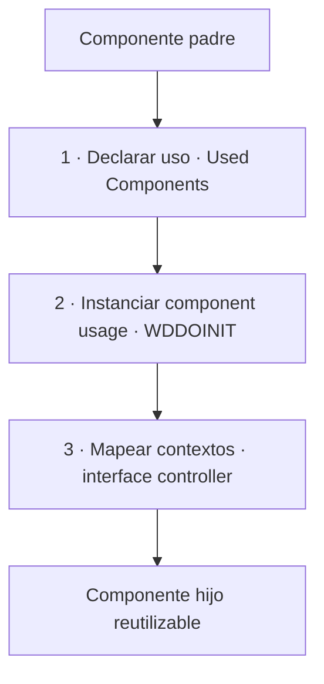

Los componentes Web Dynpro son la entidad central del framework precisamente porque permiten estructurar aplicaciones complejas mediante **entidades reutilizables**. La reutilización no es un lujo: es la razón de ser del modelo de componentes. Pero reutilizar bien tiene una técnica, y hacerlo mal genera un acoplamiento que luego pagas caro.

## Los tres pasos que no puedes saltarte

Usar un componente externo desde otro sigue una coreografía fija. Saltarse un paso es la causa habitual del clásico "el componente no aparece" o del dump al acceder a un context que no existe todavía:

1. **Declarar el uso**: en el componente contenedor añades el componente hijo en el marco *Used Web Dynpro Components*, y en la vista lo referencias en *Displays Component and Controller References*.
2. **Instanciar el component usage**: el uso no se crea solo. Hay que instanciarlo explícitamente, normalmente en `WDDOINIT`.
3. **Mapear los contextos**: una vez instanciado, el context del controlador de interfaz del componente hijo queda disponible para mapear nodos entre ambos.



## Instanciar el uso: el paso que se olvida

El framework te da la referencia al uso, pero eres tú quien decide crear la instancia. Este es el patrón canónico, con la comprobación de si ya existe para no instanciar dos veces:

```abap
" WDDOINIT: instanciar el componente reutilizado MY_COMP_USAGE
METHOD wddoinit.
  DATA lo_cmp_usage TYPE REF TO if_wd_component_usage.

  lo_cmp_usage = wd_this->wd_cpuse_my_comp_usage( ).

  IF lo_cmp_usage->has_active_component( ) IS INITIAL.
    lo_cmp_usage->create_component( ).
  ENDIF.
ENDMETHOD.
```

Ese `IF ... has_active_component( ) IS INITIAL` no es un adorno defensivo: es lo que evita recrear el componente en cada ida y vuelta y romper el estado que ya tenía.

## El mapeo de contexto es donde se gana o se pierde

Tan pronto como el uso está declarado e instanciado, el context del controlador de interfaz externo está disponible para asignaciones. Ahí defines qué nodo de tu context se mapea con qué nodo del componente hijo. Bien hecho, el hijo no sabe nada de ti: solo recibe datos en su context por el binding. Mal hecho, empiezas a llamar métodos internos del hijo desde el padre y acoplas dos componentes que deberían ser independientes.

La disciplina es la misma que en cualquier arquitectura sana: **comunícate por el contrato (el context del interface controller), nunca por las tripas**.

> Un componente reutilizable que solo funciona en la app donde nació no es reutilizable: es una dependencia con buena prensa. La prueba del algodón es poder embeberlo en otro componente sin tocar su código.

Reutilizar componentes clásicos es el techo natural de Web Dynpro puro. El siguiente peldaño es un framework construido sobre WD para estandarizar aplicaciones enteras: Floorplan Manager frente a WD clásico, en el próximo post.
