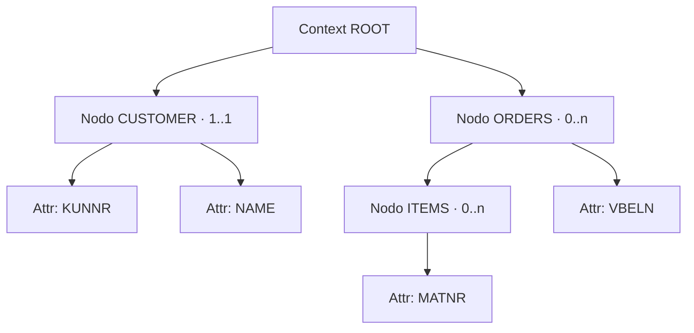

Si tuviera que elegir un solo concepto de Web Dynpro que hay que entender de verdad, sería el **context**. No la vista, no los eventos: el context. Es donde viven los datos, y su estructura determina si tu aplicación es limpia o un campo de minas de referencias rotas.

## Qué es y cómo se organiza

Los datos que usa un componente o una vista se almacenan en el context. El acceso de lectura y escritura pasa siempre por un controlador como punto de partida. La estructura es jerárquica: un nodo raíz y, por debajo, nodos y atributos en árbol.

- **Nodo**: un contenedor de datos. Puede representar una instancia única o una tabla de instancias.
- **Atributo**: un campo de datos individual dentro de un nodo, con su tipo del diccionario.
- La regla que casi nadie escribe: **el árbol del context debe reflejar la estructura de la aplicación**, no la de la base de datos.



## La cardinalidad no es decoración

Cada nodo declara una cardinalidad, y elegirla mal es la causa número uno de dumps y de comportamientos raros:

- **1..1**: una sola instancia, instanciada automáticamente.
- **0..1**: una sola instancia, que **no** debe instanciarse sola. Perfecto para un detalle opcional.
- **1..n**: varias instancias, al menos una siempre presente e instanciada automáticamente.
- **0..n**: varias instancias, ninguna obligatoria. El caso típico de una tabla que empieza vacía.

Confundir `1..1` con `0..1` cuando el dato puede no existir es la receta perfecta para un lead selection sobre un nodo vacío.

## El binding que te ahorra el trabajo sucio

La joya de Web Dynpro es el transporte automático de datos entre los elementos gráficos y el context. Tú llenas el nodo; el framework pinta la tabla. Y a la inversa.

```abap
" Rellenar un nodo 0..n con una tabla interna
DATA lo_node TYPE REF TO if_wd_context_node.
DATA lt_orders TYPE ztt_sales_order.

lt_orders = wd_assist->get_orders( ).

lo_node = wd_context->get_child_node( name = 'ORDERS' ).
lo_node->bind_table( new_items = lt_orders  set_initial_elements = abap_true ).

" Leer el elemento seleccionado por el usuario (lead selection)
DATA ls_order TYPE zsales_order.
lo_node->get_static_attributes(
  EXPORTING index = lo_node->get_lead_selection_index( )
  IMPORTING static_attributes = ls_order ).
```

Un detalle de arquitectura poco conocido: los **nodos de recursión** permiten anidar dinámicamente estructuras que se repiten (un árbol de materiales, una jerarquía de centros de coste). El nodo de recursión es una referencia a un antecesor y asume su estructura. Ojo: el nodo raíz nunca puede usarse para recursión.

> El context no es una variable global bonita. Es un contrato tipado entre tu lógica y la pantalla. Trátalo como tal y el binding trabaja para ti; ignóralo y trabajas tú para él.

Con los datos ya en su sitio, toca hablar de quién los mueve. En el próximo post: controladores y componentes, y por qué el controlador de interfaz es la puerta al resto del sistema.
