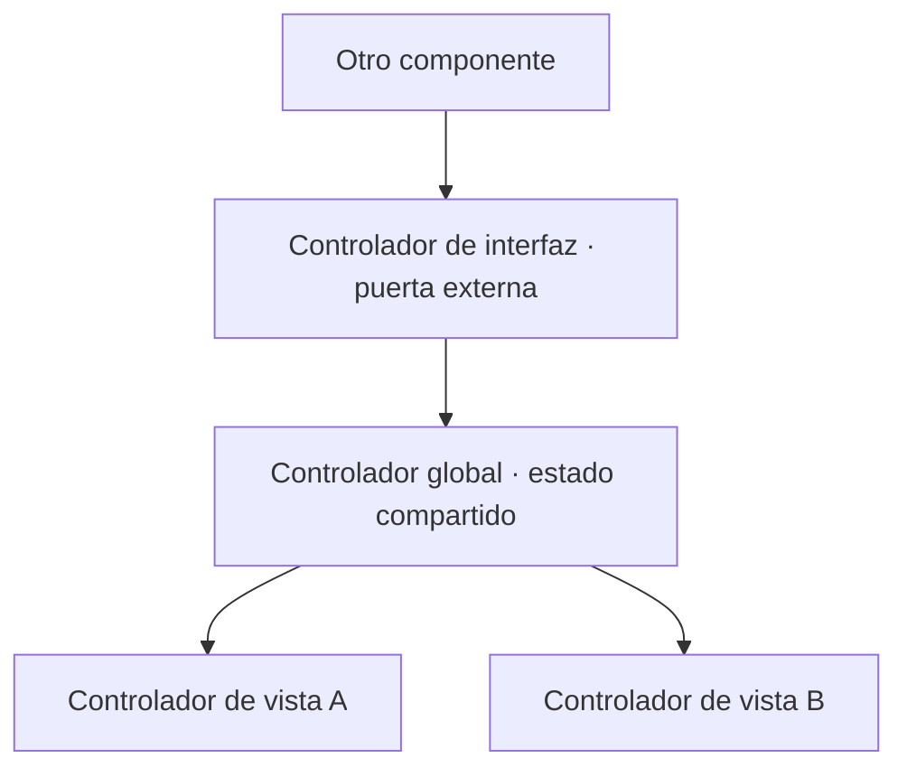

Los controladores son las partes **activas** de una aplicación Web Dynpro: determinan cómo el usuario interactúa con ella. Suena obvio, pero la mayoría de los problemas de diseño en WD vienen de no tener claro qué controlador hace qué, y de meter todo en el controlador de vista porque es el primero que aparece.

## Los tres controladores que importan

Dentro de un componente Web Dynpro conviven varias instancias de controlador, cada una con su context asociado:

- **Controlador de vista**: cada vista tiene exactamente uno. Procesa las acciones del usuario en esa vista. Vive, como mínimo, mientras la vista es visible en el navegador.
- **Controlador global (component controller)**: cada componente tiene al menos uno, visible para todos los demás controladores del componente. Es el sitio natural del estado compartido.
- **Controlador de interfaz**: cada componente tiene exactamente uno, y es global. Es visible **dentro y fuera** del componente. Es la puerta por la que un componente llama a otro.



La lectura práctica: dato que solo usa una vista, va en el context de esa vista; dato que comparten varias vistas, sube al controlador global; dato que otro componente debe ver, se expone por el controlador de interfaz. Ni un nivel más arriba de lo necesario.

## Los métodos hook: la interfaz con el framework

Cada controlador trae métodos hook estándar que **no se pueden borrar** y que el framework llama en un orden fijo dentro del modelo de fase. Nacen vacíos; los rellenas solo si necesitas intervenir en ese paso:

- `WDDOINIT` / `WDDOEXIT`: inicialización y limpieza. El sitio para instanciar el modelo o cargar datos iniciales.
- `WDDOBEFOREACTION` / `WDDOAFTERACTION`: validaciones antes y después de disparar una acción (solo en controlador de vista).
- `WDDOMODIFYVIEW`: el **único** sitio donde se permite modificar dinámicamente los controles de UI.
- `WDDOBEFORENAVIGATION` / `WDDOPOSTPROCESSING`: validación previa a navegar y limpieza justo antes de renderizar.

```abap
" WDDOINIT del controlador de vista: instanciar el modelo y precargar
METHOD wddoinit.
  DATA lo_node TYPE REF TO if_wd_context_node.

  " La clase de asistencia (modelo) ya esta disponible via wd_assist
  DATA(lt_customers) = wd_assist->get_active_customers( ).

  lo_node = wd_context->get_child_node( 'CUSTOMER' ).
  lo_node->bind_table( lt_customers ).
ENDMETHOD.
```

Meter código pesado en `WDDOMODIFYVIEW` porque "ahí funciona" es un antipatrón clásico: ese método se ejecuta en cada render y te penaliza el rendimiento sin piedad.

> El controlador de vista es para reaccionar a la pantalla, no para ser el cerebro de la aplicación. El cerebro es el modelo; el controlador solo lo orquesta.

Con los controladores claros, el siguiente eslabón es el movimiento: cómo fluyen los eventos y las acciones desde un clic hasta un cambio de vista. Ese es el próximo post.
