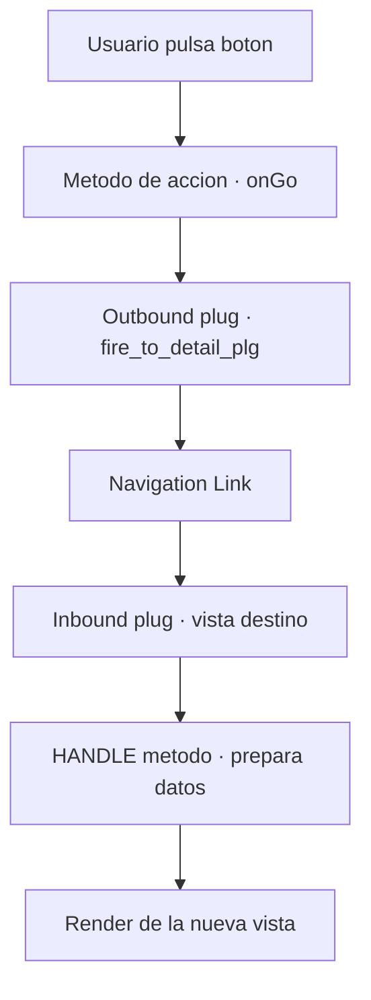

En Web Dynpro nada pasa por magia. Cuando el usuario pulsa un botón, hay una cadena precisa de pasos entre el clic y el resultado en pantalla. El desarrollador que conoce esa cadena depura en minutos; el que no, prueba a ciegas y reza. Vamos a hacer visible el flujo.

## De la acción a la navegación

Un elemento de UI como un botón tiene asignada una **acción**. Al dispararse, el framework ejecuta el método manejador de esa acción en el controlador de vista. Si el resultado es cambiar de pantalla, entra en juego el mecanismo de navegación, que no es un simple "abrir otra vista":

- **Conector de salida (Outbound Plug)**: siempre el punto de partida de una navegación. Se dispara desde cualquier método del controlador de vista.
- **Conector de entrada (Inbound Plug)**: el punto por el que se entra a una vista. Al llamarlo, el framework ejecuta su método manejador `HANDLE<nombre>`, creado automáticamente.
- **Enlace de navegación (Navigation Link)**: une un outbound plug de una vista con un inbound plug de otra. Cada outbound plug crea exactamente un enlace; un inbound plug puede recibir de varios outbound.



## Cómo se dispara en código

El disparo de un plug de salida es explícito y tipado. Por cada outbound plug, la interfaz `IF_<VIEW>` se extiende con un método `FIRE_<nombre>_PLG`, al que además puedes pasarle parámetros:

```abap
" Metodo de accion ONGO en el controlador de vista de la lista
METHOD onactiongo.
  DATA lo_node TYPE REF TO if_wd_context_node.
  DATA lv_vbeln TYPE vbeln.

  lo_node = wd_context->get_child_node( 'ORDERS' ).
  lo_node->get_attribute(
    EXPORTING name  = 'VBELN'
    IMPORTING value = lv_vbeln ).

  " Navegamos a la vista de detalle pasando el pedido seleccionado
  wd_this->fire_to_detail_plg( iv_vbeln = lv_vbeln ).
ENDMETHOD.
```

`WD_THIS` es siempre la referencia automática a la interfaz del propio controlador de vista. Nada de rutas mágicas: el plug es un método, con firma y con contrato.

## El modelo de fase manda

Todo esto ocurre dentro del **modelo de fase**, la secuencia que el framework recorre en cada solicitud. Antes de que se dispare una acción, `WDDOBEFOREACTION` permite validar; las entradas del usuario se comprueban (tipos, conversiones del diccionario) y **los datos con errores no se transportan al context**. Solo cuando todo cuadra, la navegación se ejecuta. Por eso una validación que falla no navega: no es un bug, es el diseño.

> Depurar Web Dynpro sin tener el modelo de fase en la cabeza es como depurar un pipeline sin saber el orden de las etapas. El flujo no es opcional: es el mapa.

Ya tenemos vistas que se comunican. El siguiente salto de madurez es dejar de reinventar y empezar a reutilizar: componentes reutilizables y component usage, en el próximo post.
