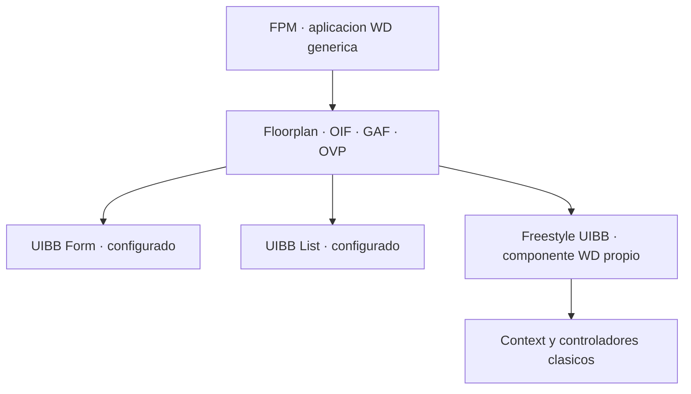

Llega un momento en todo proyecto Web Dynpro grande en el que cada desarrollador dibuja sus vistas a su manera, cablea su navegación y coloca los botones donde le parece. El resultado son veinte aplicaciones que se comportan de veinte formas distintas. **Floorplan Manager (FPM)** nace exactamente para matar ese problema.

## Qué es FPM y qué no es

FPM no es un framework nuevo que reemplaza a Web Dynpro. Es una **aplicación Web Dynpro** que actúa de marco genérico: en lugar de programar cada vista y cada plug de navegación a mano, ensamblas la aplicación a partir de bloques configurables y patrones de pantalla predefinidos.

- **Floorplan**: la plantilla de la aplicación (por ejemplo OIF para objetos, GAF para procesos guiados con roadmap, OVP para overview pages).
- **UIBB (UI Building Block)**: los bloques que rellenan el floorplan. Los estándar (Form, List) se configuran sin código; los *Freestyle UIBB* son componentes Web Dynpro normales que tú programas.
- **Configuración frente a codificación**: gran parte del layout y la navegación se define en configuración, no en ABAP.



Lo importante: por debajo de FPM sigue habiendo context, controladores, métodos hook y binding. Todo lo que aprendiste de WD clásico **sigue vigente**; FPM solo pone orden encima.

## Dónde tocas código de verdad

En un UIBB freestyle implementas la interfaz de feeder o trabajas con el modelo de tu componente igual que siempre. La lógica de negocio sigue viviendo donde debe: en la clase de asistencia o en clases delegadas.

```abap
" En un UIBB freestyle, el modelo se consume igual que en WD clasico
METHOD get_data.
  DATA(lt_items) = wd_assist->read_purchase_items( iv_ebeln = mv_ebeln ).

  DATA lo_node TYPE REF TO if_wd_context_node.
  lo_node = wd_context->get_child_node( 'ITEMS' ).
  lo_node->bind_table( lt_items ).
ENDMETHOD.
```

La ventaja no es escribir menos ABAP: es que la **navegación, el layout y el comportamiento son consistentes** entre aplicaciones sin depender de la disciplina de cada persona.

## La pregunta incómoda: FPM, WD clásico o Fiori

Seamos honestos sobre el contexto real. Web Dynpro (clásico y con FPM) sigue muy vivo en cientos de S/4HANA on-premise, y va a seguir años. Pero SAP apuesta por Fiori/UI5 como capa de UX estratégica. La decisión sensata no es dogmática:

- **Quédate en WD/FPM** si es una app interna de back-office, con usuarios expertos, sobre un sistema on-premise estable y sin requisitos de móvil ni experiencia de consumidor.
- **Estandariza con FPM** si tienes muchas aplicaciones WD dispersas: unificas antes de migrar y reduces el coste del salto futuro.
- **Migra a Fiori** cuando la app es de cara al usuario final, necesita móvil o responsive real, o vas hacia S/4HANA Cloud y Clean Core, donde WD deja de ser la dirección estratégica.

> Migrar a Fiori porque toca no es arquitectura: es moda. Quedarse en Web Dynpro por comodidad tampoco lo es. La respuesta correcta depende del usuario, del canal y de hacia dónde va tu sistema, no del framework que esté de moda.

Con esto cerramos la serie de Web Dynpro ABAP: del MVC al context, de los eventos a la reutilización, y del FPM a la decisión de migrar. La tecnología no está muerta; está madura. Y una tecnología madura se domina, no se teme.
