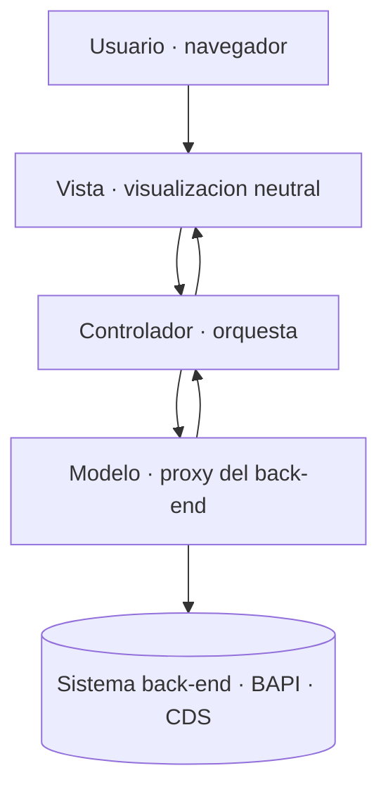

Mucha gente sigue tratando Web Dynpro ABAP como un dynpro clásico con otra pintura. Y ahí empieza el problema. Web Dynpro no es una capa de presentación: es un framework que **impone** una separación estricta entre la interfaz de usuario y la lógica de negocio, y esa imposición es exactamente lo que salva el proyecto tres años después.

## Qué separa el framework de verdad

El modelo Web Dynpro ABAP está basado completamente en el paradigma Modelo-Vista-Controlador. No es una recomendación de estilo: el framework parte la aplicación en tres piezas con interfaces claramente definidas entre ellas.

- **Modelo**: encapsula la interfaz del back-end. Actúa como un proxy que aísla la aplicación de los datos y de la tecnología de comunicación. La app no debe preocuparse de cómo se habla con el sistema.
- **Vista**: define una visualización neutral de los datos de negocio. Neutral es la palabra clave: no calcula, no decide, muestra.
- **Controlador**: administra la interacción entre vista y modelo, formatea los datos que se van a mostrar y decide qué vista viene a continuación.



## El detalle que casi todos ignoran

El paradigma MVC separa las partes del código que **generan** datos de las que los **consumen**. Suena limpio hasta que te das cuenta de que muchas unidades de un programa real necesitan hacer las dos cosas a la vez. SAP no niega esa dualidad: la organiza. Dentro de un componente Web Dynpro, algunas unidades solo consumen datos y otras generan y consumen. La disciplina consiste en saber cuál es cuál antes de escribir la primera línea.

## Dónde vive el modelo

El error más común es meter la lógica de negocio en el controlador de vista. Cualquier clase ABAP puede ser el modelo, pero la vía limpia es la **clase de asistencia** (assistance class), que hereda de `CL_WD_COMPONENT_ASSISTANCE` y se instancia automáticamente al llamar al componente:

```abap
" En cualquier metodo del controlador, el modelo esta a un paso
DATA(lo_model) = wd_assist.

DATA lt_orders TYPE ztt_sales_order.
lt_orders = lo_model->get_orders_for_customer( iv_customer = lv_kunnr ).

" La vista solo recibe datos ya cocinados; no sabe de donde vienen
wd_context->get_child_node( 'ORDERS' )->bind_table( lt_orders ).
```

Cuando el modelo es sencillo, la lógica vive en la propia clase de asistencia. Cuando crece, la clase de asistencia solo orquesta y delega en clases ABAP especializadas. Nunca al revés.

> Si tu controlador de vista lee tablas de base de datos, ya no estás haciendo MVC: estás haciendo un dynpro clásico con más ceremonia.

Web Dynpro sigue muy vivo en cientos de sistemas S/4HANA on-premise, y entender su MVC no es nostalgia: es lo que te permite mantenerlo sin miedo y decidir con criterio cuándo migrar a Fiori. En el próximo post desmontamos la pieza que hace posible todo esto: el context.
