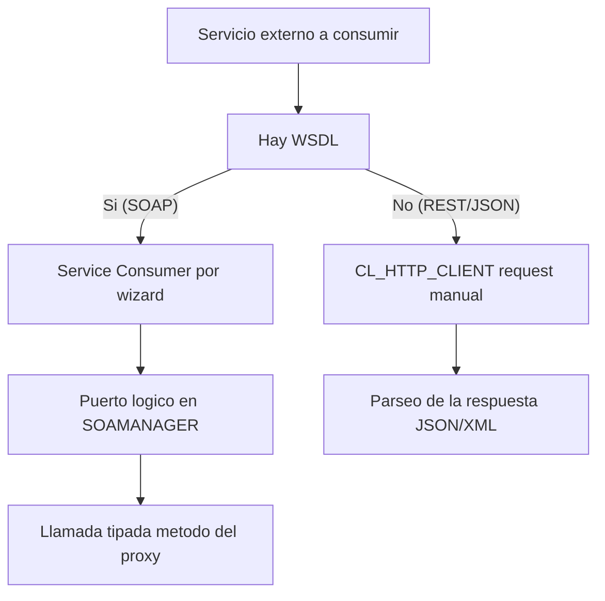

Cuando SAP no es el que expone sino el que llama, hablamos de **Web Service Consumer**: consumir la lógica de negocio de un proveedor externo desde tu entorno ABAP. Y aquí hay una bifurcación que define la calidad de tu integración: proxy generado o HTTP a mano.

## Las dos vías, y no son equivalentes

- **Proxy de servicio (SOAP)**: a partir de una URL o un fichero WSDL, un asistente genera de forma automática todas las estructuras y objetos necesarios. En tiempo de ejecución, el proxy del cliente se encarga de hablar SOAP con el proveedor. Tú trabajas con métodos y estructuras ABAP tipadas, no con XML crudo.
- **HTTP directo con `CL_HTTP_CLIENT`**: cuando no hay WSDL (típico en REST, JSON o XML), montas el request a mano, incluida la cabecera con toda la configuración. Más control, más responsabilidad.



## La pieza que todos olvidan: el puerto lógico

Consumir un SOAP con proxy no termina al activar la clase que genera el wizard. Faltan dos objetos que la gente da por hechos y no lo son:

- El **Service Consumer**: el servicio empresarial que genera SAP (vía asistente) y que produce la clase ABAP que implementa las interfaces estándar de consumo.
- El **puerto lógico**: el medio por el que viaja la comunicación entre el servicio expuesto y tu petición. Se crea en **SOAMANAGER**, a partir del mismo WSDL, y ahí es donde asignas (o dejas en blanco) el usuario de comunicación.

> Sin puerto lógico, tu proxy compila, activa y no llama a nada. Es el error silencioso más frecuente al consumir SOAP: el código está perfecto, la comunicación no existe.

## Cuando no hay WSDL: HTTP a pelo

Para REST (JSON o XML) no hay contrato que importar, así que te apoyas en `CL_HTTP_CLIENT` y la interfaz `IF_HTTP_CLIENT`:

```abap
DATA(lv_url) = |https://api.externa.com/v1/flights|.

cl_http_client=>create_by_url(
  EXPORTING url    = lv_url
  IMPORTING client = DATA(lo_http_client) ).

lo_http_client->request->set_method( 'GET' ).
lo_http_client->request->set_header_field(
  name  = 'Accept'
  value = 'application/json' ).

lo_http_client->send( ).
lo_http_client->receive( ).

DATA(lv_json) = lo_http_client->response->get_cdata( ).
lo_http_client->close( ).
```

Cada petición REST es autocontenida: ni cliente ni servidor recuerdan la anterior, toda la información necesaria viaja en la propia llamada. Esa es la ventaja del enfoque, y también el motivo por el que el parseo de la respuesta es cosa tuya.

La regla simple: **hay WSDL y necesitas tipado fuerte, usa el proxy con su puerto lógico; no hay WSDL o es REST, baja a `CL_HTTP_CLIENT`**.

En el próximo post, lo que separa un consumer de juguete de uno de producción: la gestión de errores y faults.
