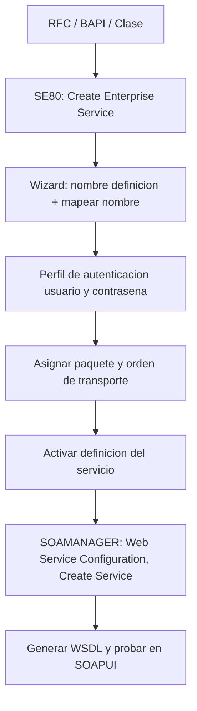

Exponer funcionalidad SAP para que la consuma un sistema externo (SAP o no) se llama **Web Service Provider**. La parte que casi nadie explica bien es que hay tres puntos de partida distintos, y elegir mal el punto de partida te condiciona todo el mantenimiento posterior.

## Tres puertas para el mismo objetivo

- **Desde un RFC**: un módulo de funciones marcado como *Permitir Ejecución Remota (RFC)*. Tiene parámetros de importación, exportación, cambio y excepciones. Es la vía cuando ya tienes tu lógica Z en un function module.
- **Desde una BAPI**: interfaces estándar de SAP, definidas como RFC, sin diálogo y estables frente a actualizaciones. Si `BAPI_FLIGHT_GETLIST` ya hace lo que necesitas, no reinventes la lógica: publícala.
- **Desde una clase ABAP (proxy)**: aquí el flujo se invierte. A partir de un WSDL, el wizard te genera una clase que implementa una interfaz con un método de `INPUT` (recibe el request) y `OUTPUT` (devuelve el response). Tú solo rellenas la lógica.

> La regla que ahorra retrabajo: si la lógica ya existe como BAPI liberada, la expones. No la copias. Un provider que envuelve una BAPI estándar sobrevive a los upgrades sin tocarlo.

## El flujo real, sin capturas



Sobre la función RFC pulsas botón derecho y eliges **Create -> Enterprise Service**. El wizard te pide nombre de la definición, te propone marcar *mapear nombre*, seleccionas la autenticación (usuario y contraseña), asignas paquete y orden de transporte, y activas. Después, en **SOAMANAGER**, pestaña *Service Administration* y apartado *Web Service Configuration*, buscas la definición, pulsas *Create Service*, defines la seguridad y generas el WSDL para probarlo.

## El detalle de formato que rompe integraciones

El envío de datos por XML debe respetar los patrones que marca SAP. El caso clásico: una fecha viaja como **YYYY-MM-DD**, no como el formato interno de ABAP ni el del país del consumidor. Ignorar esto es la causa número uno de "el servicio responde pero el otro sistema no entiende la fecha".

Un function module preparado para ser provider empieza así de simple:

```abap
FUNCTION zfm_multiplicacion_user.
*"----------------------------------------------------------------------
*"*"Interfase local:
*"  IMPORTING
*"     VALUE(IV_FACTOR_1) TYPE I
*"     VALUE(IV_FACTOR_2) TYPE I
*"  EXPORTING
*"     VALUE(EV_RESULTADO) TYPE I
*"----------------------------------------------------------------------
  ev_resultado = iv_factor_1 * iv_factor_2.
ENDFUNCTION.
```

Fíjate en el **paso por valor** (`VALUE(...)`) en importing y exporting: es un requisito para que el servicio serialice bien los parámetros. Un parámetro por referencia aquí es una integración que falla en tiempo de ejecución sin decirte por qué.

En el próximo post cruzamos al otro lado: consumir un servicio externo desde ABAP con un consumer proxy.
