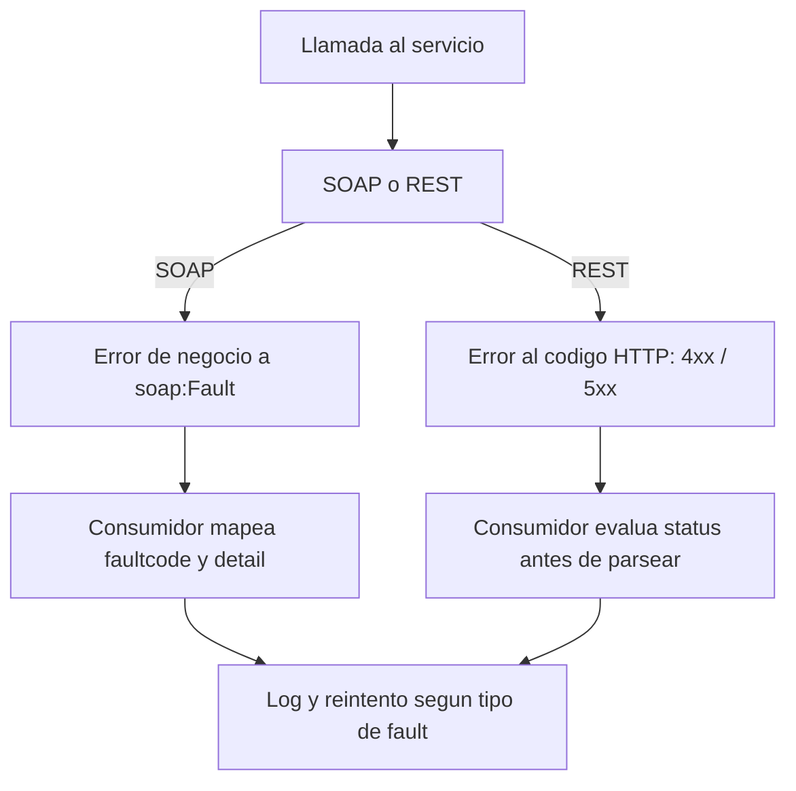

La diferencia entre una integración de demo y una de producción no está en el camino feliz. Está en qué pasa cuando algo falla. Y en Web Services ABAP hay dos mundos de errores muy distintos: el **SOAP Fault** y el **código de estado HTTP**. Mezclarlos, o ignorarlos, es la receta del fallo silencioso.

## El cuarto elemento del envelope SOAP

Un mensaje SOAP se compone de cuatro partes: **envelope, header, body y fault**. Las tres primeras las usa todo el mundo. El `fault` es el que casi nadie aprovecha, y es exactamente el que estandariza el error dentro del propio contrato.

Cuando un provider SOAP falla, no devuelves un body vacío ni un texto suelto: devuelves un fault estructurado que el consumidor sabe interpretar porque forma parte del WSDL:

```xml
<soap:Fault>
  <faultcode>soap:Server</faultcode>
  <faultstring>Divisor no puede ser cero</faultstring>
  <detail>
    <error>
      <code>ZDIV_ZERO</code>
      <message>La division por cero no esta permitida</message>
    </error>
  </detail>
</soap:Fault>
```

> Un servicio que responde HTTP 200 con un body de error escrito a mano no es tolerante a fallos: es una trampa. El consumidor cree que todo fue bien y sigue procesando basura. El fault existe para que el error viaje dentro del contrato, no fuera.

## Dos mundos de error, un solo diseño



En SOAP el error de negocio va al `fault`. En REST, el error viaja en el propio verbo del protocolo: un 4xx dice "te equivocaste tú", un 5xx dice "me equivoqué yo". La regla de oro del consumer REST: **evalúa el código HTTP antes de intentar parsear el cuerpo**. Parsear el body de un 500 como si fuera un JSON válido es cómo se llenan los logs de dumps inútiles.

## En el lado del consumer ABAP

Consumiendo por `CL_HTTP_CLIENT`, el status no te salta como excepción: tienes que pedirlo tú. Este es el patrón mínimo que debería tener todo consumer serio:

```abap
lo_http_client->send( ).
lo_http_client->receive( ).

lo_http_client->response->get_status(
  IMPORTING
    code   = DATA(lv_code)
    reason = DATA(lv_reason) ).

IF lv_code >= 400.
  " no parsees el body como respuesta valida
  MESSAGE |Servicio devolvio { lv_code }: { lv_reason }| TYPE 'E'.
ELSE.
  DATA(lv_body) = lo_http_client->response->get_cdata( ).
  " procesar la respuesta valida
ENDIF.

lo_http_client->close( ).
```

Y no olvides el `close( )`: cada cliente HTTP que dejas abierto es una conexión que no se libera. En un batch que llama al servicio mil veces, eso es un incidente esperando a ocurrir.

En el próximo post, la capa que blinda todo esto: seguridad, usuarios de comunicación y perfiles de autenticación.
