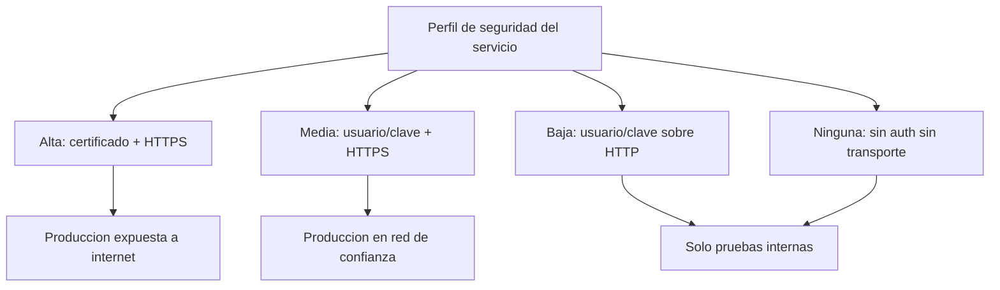

Publicar un Web Service es la parte fácil. Publicarlo sin abrir un agujero de seguridad en el ERP es la parte que distingue a un profesional. Y empieza por una decisión que muchos toman sin pensar: **con qué usuario se autentica la llamada**.

## El usuario de comunicación existe por una razón

Un usuario de comunicación (**tipo "C"**) permite que un sistema externo interactúe con SAP **sin interfaz gráfica**: no puede entrar por SAP GUI, solo hace llamadas a funciones, BAPIs, Web Services y funcionalidades específicas. Es exactamente lo que necesitas para una integración.

El error clásico es usar un usuario de **diálogo (tipo "A")** para el servicio. Ese usuario está pensado para una persona delante de una pantalla, con sus entradas múltiples verificadas. Prestarlo a una integración es regalar a un sistema externo una identidad interactiva completa. Los tipos que importan:

- **Diálogo "A"**: persona con SAP GUI. No para integraciones.
- **Sistema "B"**: procesos de fondo internos (ALE, workflow, TMS). Sin login por GUI.
- **Comunicación "C"**: sistemas externos sin GUI. **El correcto para Web Services.**
- **Servicios "S"** y **Referencia "L"**: casos específicos, autorizaciones mínimas o solo herencia.

> A un usuario de comunicación se le asignan roles y perfiles como a cualquier otro. La diferencia es que aquí "el principio de mínimo privilegio" no es un consejo: es lo único que hay entre tu servicio y un incidente. Rol acotado en PFCG, solo los objetos que el servicio necesita ejecutar.

## Los cuatro perfiles de autenticación y transporte

Al crear el servicio en SAP eliges un perfil que combina autenticación y garantía de transporte. Elegir mal aquí es exponer credenciales en claro por la red.

- **Alta**: autenticación con certificado y garantía de transporte (HTTPS). El estándar para un servicio expuesto a internet.
- **Media**: usuario y contraseña sobre HTTPS. Aceptable en red de confianza.
- **Baja**: usuario y contraseña sobre HTTP. Las credenciales viajan sin cifrar: solo pruebas internas.
- **Ninguna**: sin autenticación ni transporte seguro. En producción esto es negligencia.

## Capas que se suman, no se sustituyen

La seguridad de un servicio no es una casilla. Se apila: autenticación del solicitante por parte del proveedor, firma dentro del WSDL para garantizar integridad de datos, autorización que permite o niega el acceso a métodos concretos, y cifrado con **SSL/HTTPS** para privacidad punto a punto. Además, la API de ICF permite análisis de virus con la interfaz VSI seleccionando el perfil correspondiente.

Y no lo olvides: los servicios de **ICF** están inactivos por defecto **a propósito**. Un servicio activado sin necesidad es un riesgo, porque se accede directamente por HTTP. Activa solo lo que uses.

En el próximo post cerramos el círculo: SOAMANAGER, los puertos de enlace y por qué el fichero hosts te puede tumbar un servicio perfectamente programado.
