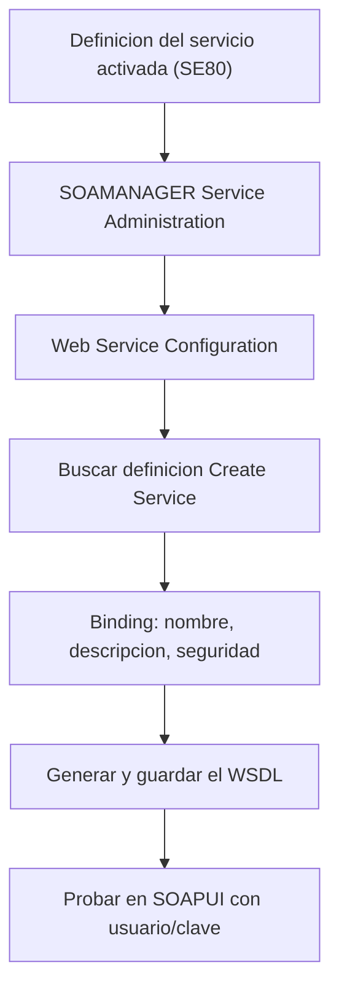

Un malentendido carísimo en proyectos SAP: creer que activar la definición de un servicio ya lo hace consumible desde fuera. No. La definición es el "qué". El endpoint publicado es el "dónde". Y quien construye el "dónde" para servicios SOAP es **SOAMANAGER**.

## Qué hace realmente SOAMANAGER

SOAMANAGER es la transacción que gestiona las puertas de enlace y lógicas, y genera el **WSDL** de los servicios SOAP. En otras palabras: habilita la comunicación entre sistemas externos y SAP. Sin pasar por ella, tu definición existe en el sistema pero nadie de fuera puede alcanzarla.

El flujo de publicación, del lado provider:



En *Service Administration*, apartado *Web Service Configuration*, buscas la definición, pulsas *Create Service*, informas nombre, descripción y datos de vinculación (binding), seleccionas la seguridad y generas el WSDL. Ese WSDL es la URL que entregas al consumidor. Del lado consumer, la misma transacción crea el **puerto lógico** a partir del WSDL del proveedor.

## El asesino silencioso: el fichero hosts

Aquí está el detalle que hace perder tardes enteras. El funcionamiento de SOAMANAGER **depende del fichero hosts del servidor**. Si el host donde vive SAP no tiene declarado su dominio, los servicios (estándar o Z) no se levantan correctamente y el WSDL sale con URLs inalcanzables.

> Un servicio programado a la perfección, activado, con seguridad impecable, puede no responder por una línea que falta en un fichero de texto del sistema operativo. Cuando el WSDL genera un host que nadie resuelve, no busques el bug en tu ABAP: mira el hosts.

Y no solo del lado servidor: el sistema que enviará las peticiones a SAP **también** debe poder resolver el dominio del servidor. Comunicación es cosa de dos extremos que se ven mutuamente.

## SOAMANAGER, WSADMIN y las transacciones que siguen ahí

Verás sistemas con **WSADMIN** y **WSCONFIG** todavía activas. No las uses para lo nuevo: siguen vivas solo hasta migrar configuraciones de SAP NetWeaver 6.40 a 7.0, y las definiciones creadas en el entorno ABAP moderno **no son visibles** en ellas. Para servicios SOAP nuevos, SOAMANAGER. Punto.

Un apunte de fronteras para no confundir herramientas: SOAMANAGER es el mundo SOAP con WSDL. Los servicios REST se publican por **SICF**, colgando un subelemento de un host virtual y poniendo tu clase (la que implementa `IF_HTTP_EXTENSION`) en el *Handler List*. Y **SAP Gateway** es otra cosa: infraestructura RESTful basada en OData para exponer datos del backend. Tres puertas, tres transacciones, ningún atajo:

```abap
" Un handler REST se registra en SICF, no en SOAMANAGER.
" La clase debe implementar IF_HTTP_EXTENSION:
CLASS zcl_rest_handler DEFINITION PUBLIC CREATE PUBLIC.
  PUBLIC SECTION.
    INTERFACES if_http_extension.
ENDCLASS.

CLASS zcl_rest_handler IMPLEMENTATION.
  METHOD if_http_extension~handle_request.
    server->response->set_cdata( |{ "status": "ok" }| ).
    server->response->set_status( code = 200 reason = 'OK' ).
  ENDMETHOD.
ENDCLASS.
```

Con esto cerramos la serie de Web Services ABAP: del concepto SOAP vs REST al servicio publicado, consumido, blindado y desplegado. La integración robusta no es magia; es saber qué transacción hace qué, y no saltarse ni el puerto lógico ni el fichero hosts.
