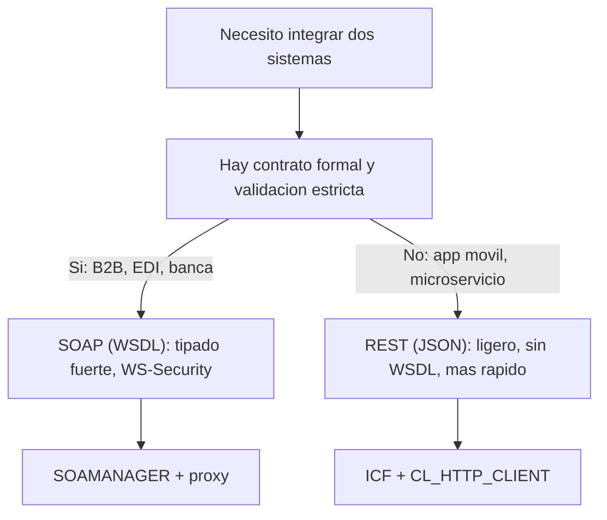

Cada vez que alguien dice "SOAP es antiguo, hay que ir a REST", se está saltando la pregunta correcta. SOAP y REST no compiten en la misma categoría: **SOAP es un protocolo, REST es un patrón arquitectónico**. Se puede hacer REST sobre SOAP como capa subyacente. Confundir eso es el origen de la mitad de las malas decisiones de integración en proyectos SAP.

## Qué es cada cosa, sin marketing

- **SOAP** (Simple Object Access Protocol): intercambia mensajes XML con un contrato formal descrito en un fichero **WSDL**. Ese contrato define operaciones, estructuras y tipos. El cliente sabe exactamente qué enviar y qué recibir antes de la primera llamada.
- **REST** (RESTful): expone recursos por HTTP usando los verbos del propio protocolo (GET, POST, PUT, DELETE). Devuelve JSON o XML. No exige WSDL ni sobre XML. Infraestructura ligera, mensajes pequeños.

La diferencia práctica se ve en el propio payload. Un mensaje SOAP en ABAP viaja envuelto en su envelope XML:

```xml
<asx:abap version="1.0" xmlns:asx="http://www.sap.com/abapxml">
  <asx:values>
    <TEXT>SOAP en ABAP</TEXT>
  </asx:values>
</asx:abap>
```

El mismo dato en REST con JSON pesa una fracción y se lee sin esfuerzo:

```json
{
  "TEXT": "JSON en ABAP"
}
```

## El criterio de decisión



- Elige **SOAP** cuando el escenario exige un contrato blindado: integraciones B2B, sistemas financieros, mensajería fiable y segura, escenarios donde el tipado fuerte y WS-Security valen su peso en ancho de banda.
- Elige **REST** cuando prima el volumen y la agilidad: apps móviles, tablets, PCs, Smart TV. El propio SAP lo reconoce como la vía cuando necesitas manejar volúmenes de información mayores que los que SOAP mueve cómodamente.

> SOAP requiere más ancho de banda porque cada mensaje carga mucha información dentro. Eso no es un defecto: es el precio de un contrato que no se rompe. La pregunta no es cuál es mejor, sino cuál paga su coste en tu escenario.

## En ABAP conviven, no compiten

Lo interesante es que SAP te da las dos vías nativas. Un provider SOAP nace de un módulo de funciones RFC, una BAPI o una clase, y se publica con un WSDL desde **SOAMANAGER**. Un servicio REST se construye con una clase que implementa `IF_HTTP_EXTENSION` y se activa en **SICF**, sin WSDL de por medio. Mismo stack, dos herramientas distintas.

El error caro es dogmático: montar un WSDL y un proxy pesado para exponer tres campos a una app móvil, o improvisar un parser de XML a mano cuando el escenario pedía a gritos el contrato tipado de SOAP.

En el próximo post construimos un provider SOAP real desde cero: de la BAPI al servicio publicado, paso a paso.
